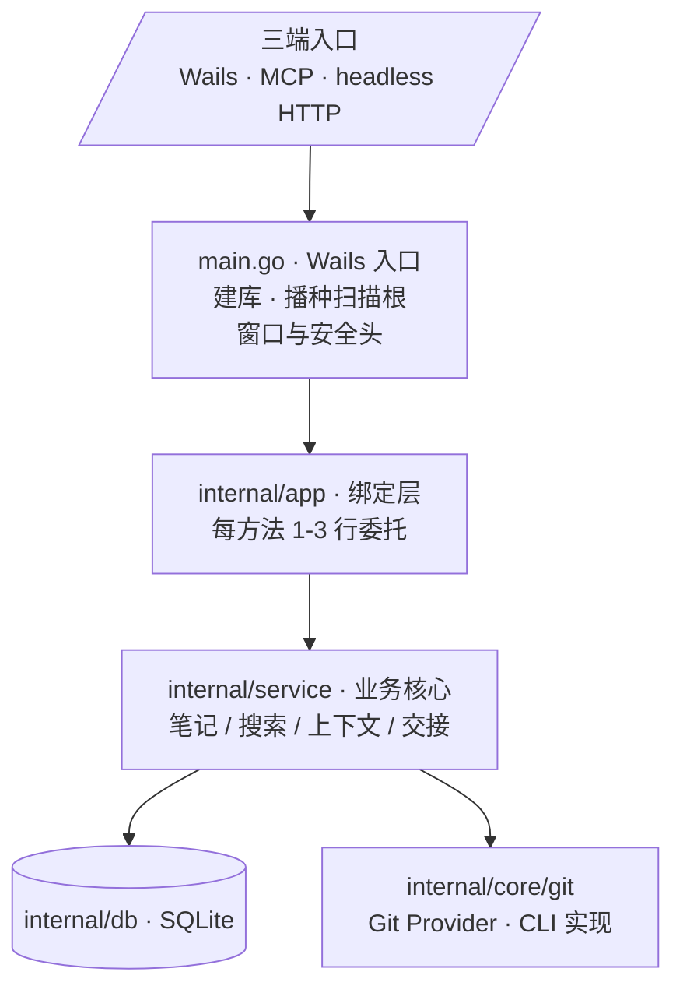
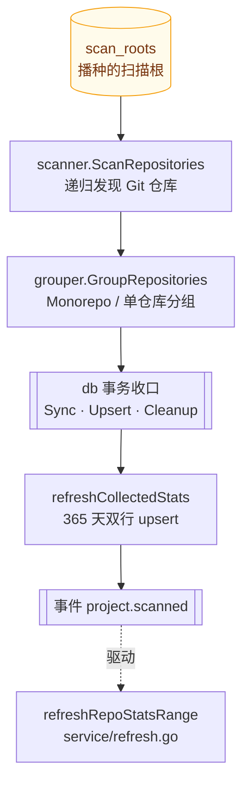
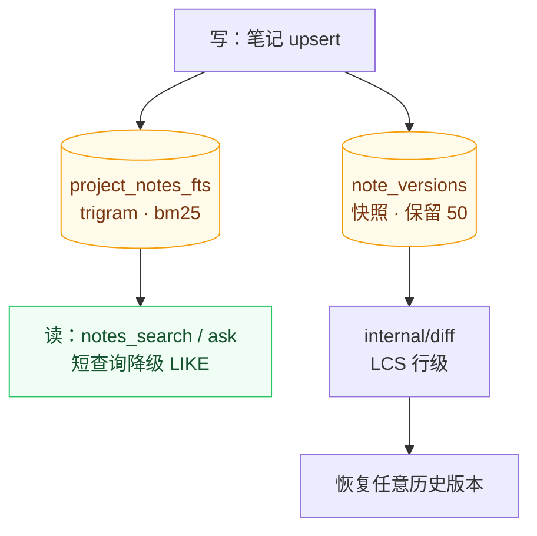
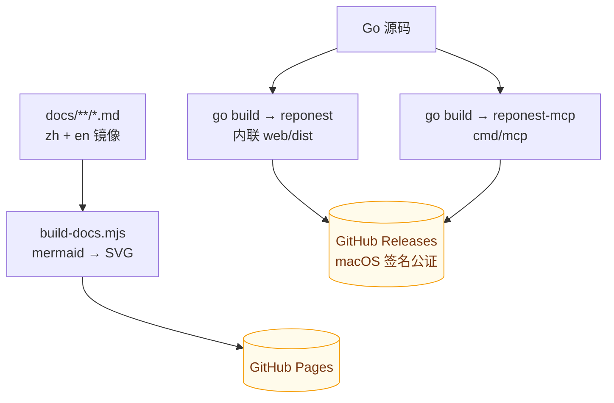

# 架构说明

> 1.7.0 服务层重构的动机与取舍见 [ADR-0005](adr/0005-service-layer.md)；产品定位见 [ADR-0002](adr/0002-c-end-repositioning.md)。

## 总体形态

单文件 **Wails v2** 桌面应用：Go 后端 + React SPA（`web/dist` 经 `go:embed` 打进二进制），SQLite（modernc 纯 Go，零 CGO），统计通过本机 `git` CLI 读取。**本地优先**：不上传数据；桌面应用自身不监听端口，另有可选的 headless HTTP API（`cmd/server`，仅监听 `127.0.0.1`，供本地工具集成，默认不随桌面应用启动）。

## 分层（后端）



读图：箭头是调用方向，自上而下**逐层变薄**——`main.go` 只做启动期初始化，`internal/app` 每个方法 1-3 行纯委托，逻辑全部收敛到 `internal/service`；再往下分成两条数据出口，写库走 `internal/db`，读 git 走 `internal/core/git` 的 Provider 抽象（本地实现是 CLI，换成别的实现不影响上层）。最上方的 `三端入口` 是同一个入口的三个面——Wails 桌面、MCP、headless HTTP，谁都不是特例，见下段。

**Wails 桌面、MCP（cmd/mcp）与 headless HTTP（cmd/server）三种入口共享同一 service 实现**——行为永远一致，新功能只需实现一次。两个例外直连 db：`internal/core/plugin/runtime`（插件知识导入的 upsert 管线）与 `internal/importers/claude`（Claude 记忆读取），均为 service 之外的既有约定。

支撑包：`internal/domain`（跨层行类型）、`internal/version`（版本 SSOT）、`internal/diff`（笔记行级 diff）、`internal/stats`（git log 解析）、`internal/knowledge`（仓库知识挖掘）、`internal/scanner` + `internal/grouper`（扫描与分组）、`internal/platform`（OS 差异）、`internal/core/plugin`（插件 SPI + yaegi 运行时）、`internal/integrity`（数据可信度审计：FTS 漂移/孤儿行/缓存新鲜度等 6 项只读检查）、`internal/httpapi`（headless HTTP JSON API，service 的 HTTP 壳）、`internal/importers/claude`（Claude 记忆幂等导入）。

## 关键数据流

### 扫描管线（service/scan.go，唯一管线）



读图：一条**单向、事务收口**的管线。发现与分组在事务外（可能很慢，不该占着写锁），三个写操作 `SyncProjectTx` / `UpsertRepositoryTx` / `CleanupStaleDataTx` 在**同一个事务**内完成——这是「重复扫描不产生脏数据」的根本原因。末尾抛 `project.scanned` 事件，触发其后的统计刷新循环（下一节）。

### 统计刷新（service/refresh.go，唯一循环）

`refreshRepoStatsRange`：对单仓库按日期区间查询 `git log --shortstat` 聚合，跳过零行，写 `all` 与个人作者两行；取消感知。扫描完成刷新、项目历史回填、按需单日刷新共用此实现。

### 知识库



读图：**写一次，读两路**。笔记落库时由触发器同时维护 FTS 索引（检索侧）与版本快照（历史侧），应用层零维护代码——索引不可能与正文失配，除非触发器被破坏（这正是 `reponest_integrity` 的检查项，见[AI 集成](features/ai-integration.md#就绪度-vs-数据可信度)）。检索侧读 trigram 索引拿相关性与 snippet，历史侧读快照算 LCS diff。细节见 [ADR-0003](adr/0003-fts5-search.md)。

### 插件运行时（ADR-0002）

yaegi 解释 `<config>/reponest/plugins/*/plugin.go`；事件总线 + 知识源注册表；内置 `claude` 导入器与脚本插件同一 upsert 路径。

## 前端（web/src）

```
api/        types + transport（Wails window.go / HTTP 双模）+ endpoints（每后端方法一个函数）
hooks/      useApiData（TTL 缓存+去重）/ useDebouncedCallback / useScanPolling / useConfirmClick
pages/      Knowledge（首页）/ Dashboard / ProjectDetail / Settings，大页面按域拆子组件
components/ ProjectCard / Heatmap / TrendChart / notes/NoteEditor / notes/VersionHistoryPanel…
locales/    zh-CN + en（i18next 懒加载）
styles/     设计系统：tokens / reset / components / layouts / features
```

无全局状态库：页面级 `useState` + hooks；主题走 `data-theme` CSS 变量。

## 数据库（internal/db）

单文件 SQLite（WAL + 外键），12 个版本化迁移自动执行；表：`projects` / `repositories` / `daily_stats` / `project_notes`(+FTS) / `project_todos`(+FTS) / `note_versions` / `repo_meta` / `app_config` / `scan_roots`。查询按域拆分文件（projects.go / notes.go / …）；升降级等事务操作（`SplitProjectDown` / `MergeProjectUp`）有单测覆盖。

## 构建与产物



读图：两条产物线——桌面应用把 `web/dist` 用 `go:embed` 打进二进制（用户只拿到一个文件），MCP server 是独立 stdio 二进制；右侧是文档站，**图在构建期就渲染成内联 SVG**，因此页面零运行时依赖、可离线，GitHub 原生渲染与文档站同源可读。

| 产物 | 来源 | 说明 |
|------|------|------|
| `reponest` | 根包 | Wails 桌面应用（`scripts/build.sh`） |
| `reponest-mcp` | `cmd/mcp` | MCP stdio 服务器（知识库查询 + agent-score 自检） |

CI（`.github/workflows/release.yml`）多平台构建 + macOS 签名公证；文档站（`pages.yml`）由 `scripts/build-docs.mjs` 从 `docs/**/*.md` 生成后部署 GitHub Pages。

## 命名分层

品牌展示层与机器标识层**有意不一致**——标识层（URL、包名、数据目录、对外契约）不随品牌措辞变化，保证升级链与数据迁移稳定：

| 层 | 取值 | 说明 |
|------|------|------|
| 品牌名 | `RepoNest` | `productName`、应用内 Logo、文档文案 |
| 完整展示名 | `RepoNest: Local Git Knowledge Base` | 窗口标题（`main.go` 的 Wails `options.Title`）与 HTML `<title>` |
| 仓库与包标识 | `repo-nest` | GitHub 仓库名、Go module 名、npm 包名 |
| 冻结标识 | `reponest` | 二进制/命令名、用户数据目录（`internal/platform` 的 `dirName`）、MCP server 名与工具前缀 |

冻结标识不参与「品牌统一」：数据目录已经历 gitboard → gitbuddy → reponest 两轮迁移（`internal/platform/platform.go` 的 legacy 迁移逻辑），MCP 工具名是对 AI 客户端的对外契约。
