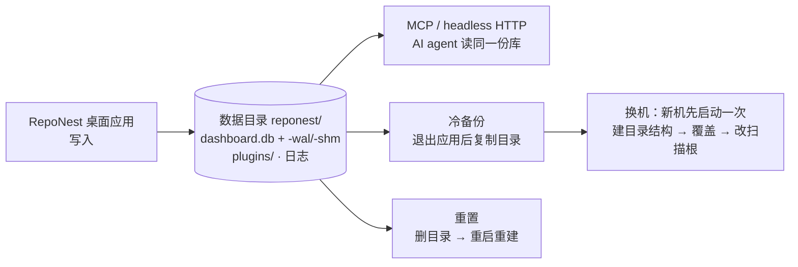

# 数据与备份

RepoNest 是本地优先应用：没有云服务与账号体系，全部知识数据（笔记、待办、项目元数据、统计）只存在于本机一个 SQLite 数据库中。AI（如 Claude Code）通过 MCP 读取的也是这份本机数据。因此**备份 = 复制一个目录，迁移 = 搬运一个目录**。



读图：中间那个方框是**唯一的事实源**——桌面应用写入，AI 侧读同一份库，备份、迁移、重置三个操作全部只是对它的复制或删除。这也解释了本页两个关键约束：数据库是 WAL 模式（运行中直接复制可能丢失未落盘的 `-wal` 内容，所以备份前要**先退出应用**），以及扫描根以**绝对路径**存库（换机后必须到设置里改成本机路径）。

## 数据都在哪

| 内容 | 位置 |
|------|------|
| 数据库（含笔记、待办、版本历史、统计、扫描根配置） | 见下表「数据目录」中的 `dashboard.db` |
| 插件 | 数据目录下 `plugins/` |
| 日志 | 平台日志目录（见[故障排查](troubleshooting.md#日志文件位置)） |

数据目录：

| 平台 | 路径 |
|------|------|
| macOS | `~/Library/Application Support/reponest/` |
| Windows | `%APPDATA%\reponest\` |
| Linux | `~/.config/reponest/` |

## 备份

1. **退出 RepoNest**（数据库为 WAL 模式，运行中直接复制可能丢失未落盘的 WAL 内容）
2. 复制整个数据目录 `reponest/`（或至少 `dashboard.db` 与 `dashboard.db-wal` / `dashboard.db-shm`）

建议在更换磁盘、大版本升级前做一次冷备份；日常也可以把数据目录纳入你的时间机 / 文件历史等整盘备份。

## 换机迁移

1. 旧机器：退出应用，复制数据目录
2. 新机器：[安装 RepoNest](getting-started.md#下载安装)，**先启动一次再退出**（让应用建好目录结构与 schema）
3. 用备份的数据目录覆盖新机器上的 `reponest/`，重新启动

注意：扫描根目录以**绝对路径**存于数据库。如果新机器的用户名或目录结构不同，启动后到 **设置 → 扫描目录** 中改成本机路径，再点「重新扫描」。仓库位置变了的话，项目分组（Monorepo 拆分/合并记录）按新路径重新识别即可，笔记与待办不受影响。

## 重置

应用内没有「恢复出厂」按钮，重置 = 删除数据目录后重启：

```bash
# macOS 示例：先退出应用
rm -rf ~/Library/Application\ Support/reponest
```

重启后会重新播种默认扫描根、重建空数据库。**这会清空全部笔记与待办**，操作前确认已有备份。

只清统计、保留笔记没有内置开关：如需如此，删除数据库前先在知识库中[导出笔记](features/knowledge.md#导出)，重置后再导入。

## 卸载

1. 删除二进制（安装脚本装在 `/usr/local/bin/reponest`；Windows 为 `%LOCALAPPDATA%\RepoNest\reponest.exe`，或你手动放置的位置）
2. 删除数据目录（见上表）与日志（`~/Library/Logs/reponest.log` 等平台日志路径）
3. 如安装过 PWA：在系统/浏览器的应用列表中移除 RepoNest

## 相关页面

- [快速开始](getting-started.md)：数据与日志位置速览
- [故障排查](troubleshooting.md)：日志定位与常见问题
- [存储结构优化与 AI 价值](storage-optimization.md)：为什么知识库比让 AI 直接读 git 更好
