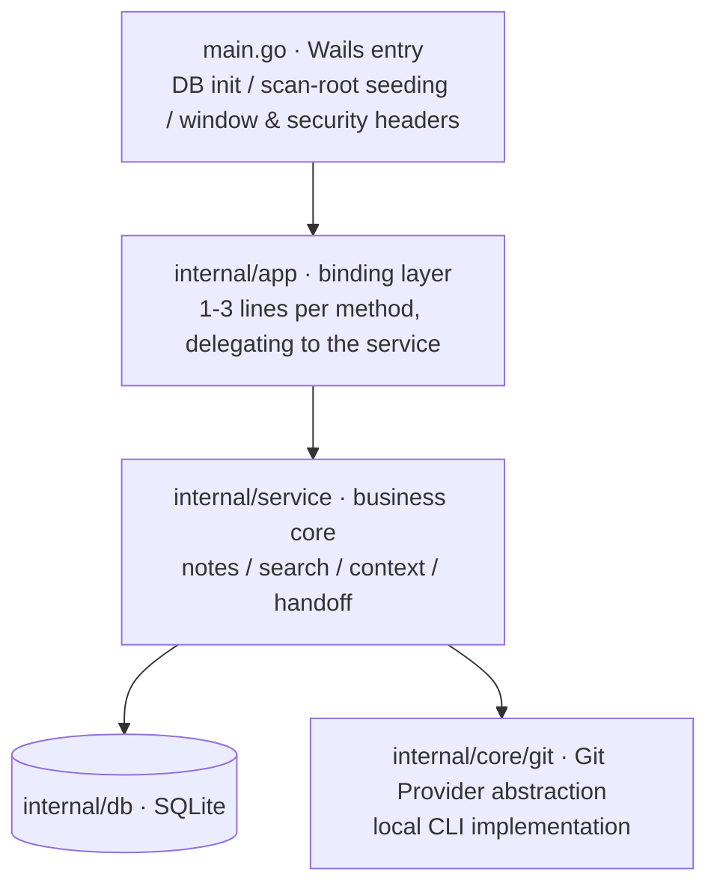

# Architecture

> For the motivation and trade-offs behind the 1.7.0 service layer refactor, see [ADR-0005](adr/0005-service-layer.md); for product positioning, see [ADR-0002](adr/0002-c-end-repositioning.md).

## Big picture

A single-binary **Wails v2** desktop app: Go backend + React SPA (`web/dist` embedded into the binary via `go:embed`), SQLite (modernc pure Go, zero CGO), with statistics read through the local `git` CLI. **Local-first**: no data is uploaded; the desktop app itself listens on no ports. There is also an optional headless HTTP API (`cmd/server`, listens on `127.0.0.1` only, for local tool integration; not started alongside the desktop app by default).

## Layering (backend)



**All three entry points — the Wails desktop app, MCP (`cmd/mcp`), and headless HTTP (`cmd/server`) — share the same service implementation**, so behavior is always consistent and every new feature is implemented only once. Two exceptions talk to db directly: `internal/core/plugin/runtime` (the upsert pipeline for plugin knowledge imports) and `internal/importers/claude` (Claude memory reads) — both are pre-existing conventions outside the service.

Supporting packages: `internal/domain` (cross-layer row types), `internal/version` (version SSOT), `internal/diff` (line-level note diffs), `internal/stats` (git log parsing), `internal/knowledge` (repository knowledge mining), `internal/scanner` + `internal/grouper` (scanning and grouping), `internal/platform` (OS differences), `internal/core/plugin` (plugin SPI + yaegi runtime), `internal/integrity` (data trustworthiness audit: 6 read-only checks including FTS drift, orphan rows, and cache freshness), `internal/httpapi` (headless HTTP JSON API, the HTTP shell over the service), `internal/importers/claude` (idempotent Claude memory imports).

## Key data flows

### Scan pipeline (service/scan.go, the single pipeline)

```
scan_roots ──▶ scanner.ScanRepositories ──▶ grouper.GroupRepositories
        ──▶ db transaction: SyncProjectTx + UpsertRepositoryTx + CleanupStaleDataTx
        ──▶ refreshCollectedStats (365-day window, dual-row upsert for all + personal author)
        ──▶ event project.scanned
```

### Stats refresh (service/refresh.go, the single loop)

`refreshRepoStatsRange`: for a single repository, aggregates `git log --shortstat` over a date range, skips zero-row results, and writes two rows — `all` and the personal author; cancellation-aware. The post-scan refresh, project history backfill, and on-demand single-day refresh all share this implementation.

### Knowledge base

`project_notes` + an FTS5 trigram virtual table (bm25 ranking; short queries fall back to LIKE — see [ADR-0003](adr/0003-fts5-search.md)); every update writes a `note_versions` snapshot via trigger (the last 50 are kept), and diffs are generated by `internal/diff` via LCS.

### Plugin runtime (ADR-0002)

yaegi interprets `<config>/reponest/plugins/*/plugin.go`; event bus + knowledge source registry; the built-in `claude` importer and script plugins share the same upsert path.

## Frontend (web/src)

```
api/        types + transport (Wails window.go / HTTP dual mode) + endpoints (one function per backend method)
hooks/      useApiData (TTL cache + dedup) / useDebouncedCallback / useScanPolling / useConfirmClick
pages/      Knowledge (home) / Dashboard / ProjectDetail / Settings; large pages are split into per-domain subcomponents
components/ ProjectCard / Heatmap / TrendChart / notes/NoteEditor / notes/VersionHistoryPanel…
locales/    zh-CN + en (lazy-loaded via i18next)
styles/     design system: tokens / reset / components / layouts / features
```

No global state library: page-level `useState` + hooks; theming via `data-theme` CSS variables.

## Database (internal/db)

Single-file SQLite (WAL + foreign keys), 12 versioned migrations applied automatically; tables: `projects` / `repositories` / `daily_stats` / `project_notes`(+FTS) / `project_todos`(+FTS) / `note_versions` / `repo_meta` / `app_config` / `scan_roots`. Queries are split into files by domain (projects.go / notes.go / …); transactional operations such as split down / merge up (`SplitProjectDown` / `MergeProjectUp`) are covered by unit tests.

## Build and artifacts

| Artifact | Source | Description |
|------|------|------|
| `reponest` | Root package | Wails desktop app (`scripts/build.sh`) |
| `reponest-mcp` | `cmd/mcp` | MCP stdio server (knowledge base queries + agent-score self-check) |

CI (`.github/workflows/release.yml`) builds for multiple platforms plus macOS signing and notarization; the docs site (`pages.yml`) is generated from `docs/**/*.md` by `scripts/build-docs.mjs` and deployed to GitHub Pages.

## Naming layering

The brand presentation layer and the machine identity layer are **intentionally inconsistent** — the identity layer (URLs, package names, data directory, external contracts) does not follow brand wording, which keeps the upgrade chain and data migrations stable:

| Layer | Value | Notes |
|------|------|------|
| Brand name | `RepoNest` | `productName`, in-app logo, documentation copy |
| Full display name | `RepoNest: Local Git Knowledge Base` | Window title (the Wails `options.Title` in `main.go`) and the HTML `<title>` |
| Repository and package identity | `repo-nest` | GitHub repo name, Go module name, npm package name |
| Frozen identifiers | `reponest` | Binary/command name, user data directory (the `dirName` in `internal/platform`), MCP server name and tool prefix |

Frozen identifiers are exempt from "brand unification": the data directory has already gone through two migrations (gitboard → gitbuddy → reponest; see the legacy migration logic in `internal/platform/platform.go`), and MCP tool names are an external contract with AI clients.
