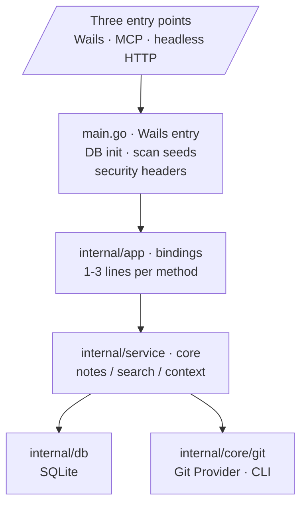
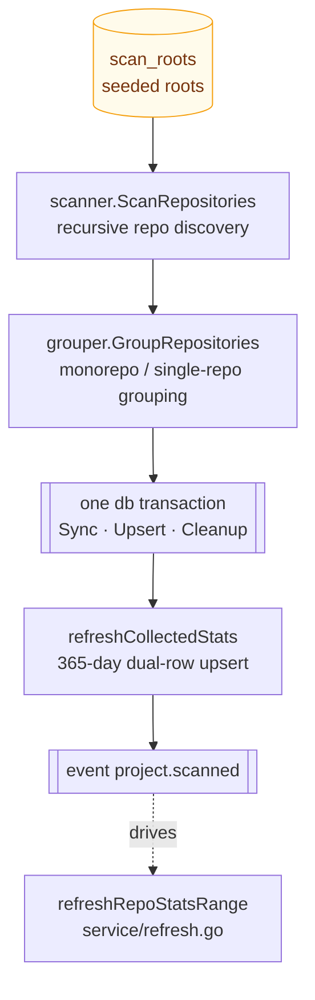
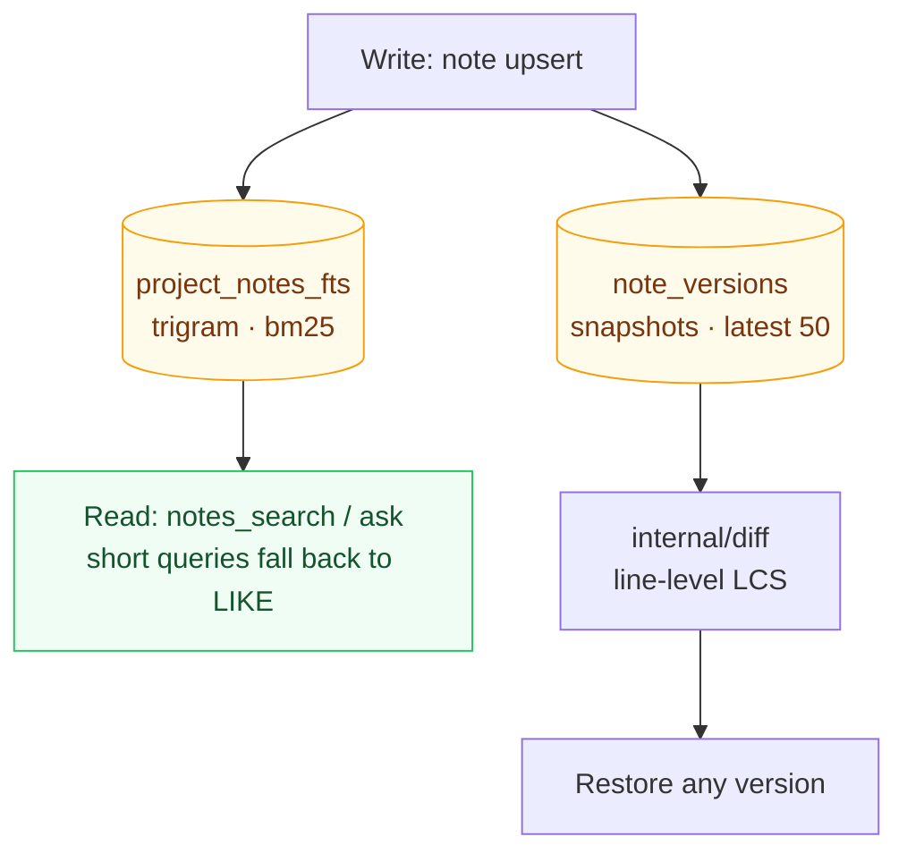
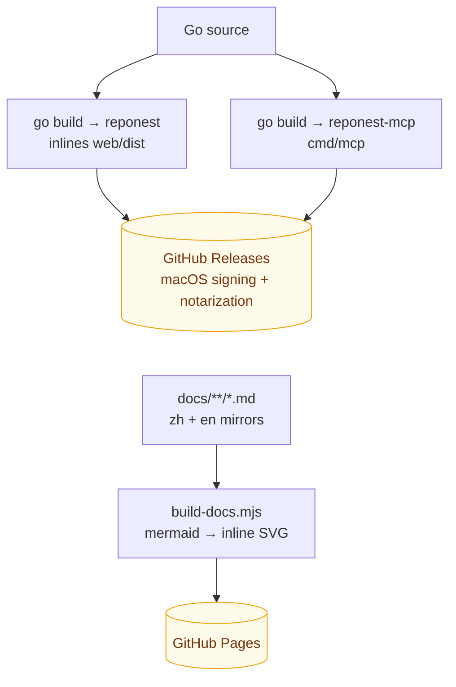

# Architecture

> For the motivation and trade-offs behind the 1.7.0 service layer refactor, see [ADR-0005](adr/0005-service-layer.md); for product positioning, see [ADR-0002](adr/0002-c-end-repositioning.md).

## Big picture

A single-binary **Wails v2** desktop app: Go backend + React SPA (`web/dist` embedded into the binary via `go:embed`), SQLite (modernc pure Go, zero CGO), with statistics read through the local `git` CLI. **Local-first**: no data is uploaded; the desktop app itself listens on no ports. There is also an optional headless HTTP API (`cmd/server`, listens on `127.0.0.1` only, for local tool integration; not started alongside the desktop app by default).

## Layering (backend)



How to read it: the arrows show call direction, and the layers **thin out** as you go down — `main.go` only does startup initialization, `internal/app` is pure delegation at 1-3 lines per method, and all logic converges in `internal/service`. Below that it splits into two data outlets: writes go to `internal/db`, git reads go through the Provider abstraction in `internal/core/git` (the local implementation is the CLI; swapping it never affects the layers above). The `Three entry points` node at the top is one entry seen from three sides — Wails desktop, MCP, and headless HTTP, none of them a special case (see below).

**All three entry points — the Wails desktop app, MCP (`cmd/mcp`), and headless HTTP (`cmd/server`) — share the same service implementation**, so behavior is always consistent and every new feature is implemented only once. Two exceptions talk to db directly: `internal/core/plugin/runtime` (the upsert pipeline for plugin knowledge imports) and `internal/importers/claude` (Claude memory reads) — both are pre-existing conventions outside the service.

Supporting packages: `internal/domain` (cross-layer row types), `internal/version` (version SSOT), `internal/diff` (line-level note diffs), `internal/stats` (git log parsing), `internal/knowledge` (repository knowledge mining), `internal/scanner` + `internal/grouper` (scanning and grouping), `internal/platform` (OS differences), `internal/core/plugin` (plugin SPI + yaegi runtime), `internal/integrity` (data trustworthiness audit: 6 read-only checks including FTS drift, orphan rows, and cache freshness), `internal/httpapi` (headless HTTP JSON API, the HTTP shell over the service), `internal/importers/claude` (idempotent Claude memory imports).

## Key data flows

### Scan pipeline (service/scan.go, the single pipeline)



How to read it: a **one-way pipeline that closes inside a transaction**. Discovery and grouping happen outside the transaction (they can be slow and should not hold the write lock), while the three writes `SyncProjectTx` / `UpsertRepositoryTx` / `CleanupStaleDataTx` land in **the same transaction** — that is exactly why re-scanning never produces dirty data. It ends by emitting `project.scanned`, which drives the stats refresh loop that follows (next section).

### Stats refresh (service/refresh.go, the single loop)

`refreshRepoStatsRange`: for a single repository, aggregates `git log --shortstat` over a date range, skips zero-row results, and writes two rows — `all` and the personal author; cancellation-aware. The post-scan refresh, project history backfill, and on-demand single-day refresh all share this implementation.

### Knowledge base



How to read it: **one write, two read paths**. When a note is persisted, triggers maintain the FTS index (the retrieval side) and the version snapshot (the history side) at the same time — the application layer has zero maintenance code, so the index cannot drift out of sync with the content unless the triggers are broken (which is exactly what `reponest_integrity` checks, see [AI integration](features/ai-integration.md#readiness-vs-data-trust)). The retrieval side reads the trigram index for relevance and snippets; the history side reads snapshots to compute the LCS diff. Details in [ADR-0003](adr/0003-fts5-search.md).

### Plugin runtime (ADR-0002)

yaegi interprets `<config>/reponest/plugins/*/plugin.go`; event bus + knowledge source registry; the built-in `claude` importer and script plugins share the same upsert path.

## Frontend (web/src)

```
api/        types + transport (Wails window.go / HTTP dual mode) + endpoints (one function per backend method)
hooks/      useApiData (TTL cache + dedup) / useDebouncedCallback / useScanPolling / useConfirmClick
pages/      Knowledge (home) / Dashboard / ProjectDetail / Settings; large pages are split into per-domain subcomponents
components/ ProjectCard / Heatmap / TrendChart / notes/NoteEditor / notes/VersionHistoryPanel…
locales/    zh-CN + en (lazy-loaded via i18next)
styles/     design system: tokens / reset / components / layouts / features
```

No global state library: page-level `useState` + hooks; theming via `data-theme` CSS variables.

## Database (internal/db)

Single-file SQLite (WAL + foreign keys), 12 versioned migrations applied automatically; tables: `projects` / `repositories` / `daily_stats` / `project_notes`(+FTS) / `project_todos`(+FTS) / `note_versions` / `repo_meta` / `app_config` / `scan_roots`. Queries are split into files by domain (projects.go / notes.go / …); transactional operations such as split down / merge up (`SplitProjectDown` / `MergeProjectUp`) are covered by unit tests.

## Build and artifacts



How to read it: two artifact lines — the desktop app inlines `web/dist` into the binary via `go:embed` (the user downloads a single file), while the MCP server is a separate stdio binary; below it is the docs site, where **diagrams are rendered into inline SVG at build time**, so pages carry zero runtime dependencies, work offline, and read the same on GitHub as they do on the site.

| Artifact | Source | Description |
|------|------|------|
| `reponest` | Root package | Wails desktop app (`scripts/build.sh`) |
| `reponest-mcp` | `cmd/mcp` | MCP stdio server (knowledge base queries + agent-score self-check) |

CI (`.github/workflows/release.yml`) builds for multiple platforms plus macOS signing and notarization; the docs site (`pages.yml`) is generated from `docs/**/*.md` by `scripts/build-docs.mjs` and deployed to GitHub Pages.

## Naming layering

The brand presentation layer and the machine identity layer are **intentionally inconsistent** — the identity layer (URLs, package names, data directory, external contracts) does not follow brand wording, which keeps the upgrade chain and data migrations stable:

| Layer | Value | Notes |
|------|------|------|
| Brand name | `RepoNest` | `productName`, in-app logo, documentation copy |
| Full display name | `RepoNest: Local Git Knowledge Base` | Window title (the Wails `options.Title` in `main.go`) and the HTML `<title>` |
| Repository and package identity | `repo-nest` | GitHub repo name, Go module name, npm package name |
| Frozen identifiers | `reponest` | Binary/command name, user data directory (the `dirName` in `internal/platform`), MCP server name and tool prefix |

Frozen identifiers are exempt from "brand unification": the data directory has already gone through two migrations (gitboard → gitbuddy → reponest; see the legacy migration logic in `internal/platform/platform.go`), and MCP tool names are an external contract with AI clients.
