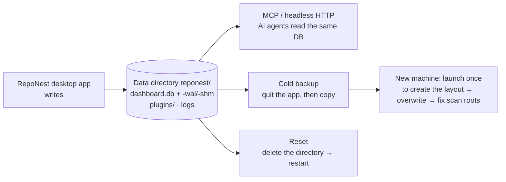

# Data and Backup

RepoNest is a local-first app: there are no cloud services or accounts, and all knowledge data (notes, todos, project metadata, statistics) lives only in a single SQLite database on your machine. AI clients such as Claude Code read that same local data over MCP. That means **backing up = copying one directory, and migrating = moving one directory**.



How to read it: the box in the middle is the **single source of truth** — the desktop app writes it, the AI side reads the same database, and backup / migration / reset are all just a copy or a deletion of it. That is also where this page's two constraints come from: the database runs in WAL mode (copying it while the app is running can lose un-flushed `-wal` content, so **quit the app before backing up**), and scan roots are stored as **absolute paths** (after migrating machines you must change them to the new paths in Settings).

## Where the Data Lives

| Item | Location |
|------|------|
| Database (notes, todos, version history, statistics, scan root configuration) | `dashboard.db` inside the data directory in the table below |
| Plugins | `plugins/` under the data directory |
| Logs | Platform log directory (see [Troubleshooting](troubleshooting.md#log-file-locations)) |

Data directory:

| Platform | Path |
|------|------|
| macOS | `~/Library/Application Support/reponest/` |
| Windows | `%APPDATA%\reponest\` |
| Linux | `~/.config/reponest/` |

## Backup

1. **Quit RepoNest** (the database runs in WAL mode; copying it while the app is running can lose WAL content that has not been flushed to disk)
2. Copy the entire data directory `reponest/` (or at least `dashboard.db` together with `dashboard.db-wal` / `dashboard.db-shm`)

We recommend taking a cold backup before swapping disks or upgrading to a major version; day to day, you can also include the data directory in your whole-disk backups such as Time Machine or File History.

## Migrating to a New Machine

1. Old machine: quit the app and copy the data directory
2. New machine: [install RepoNest](getting-started.md#download-and-install), then **launch it once and quit** (so the app creates the directory structure and schema)
3. Replace the `reponest/` directory on the new machine with your backed-up copy, then start the app again

Note: scan roots are stored in the database as **absolute paths**. If the new machine has a different username or directory layout, open **Settings → Scan Directories** after launch, update them to the local paths, and click **Rescan**. If repositories have moved, project grouping (monorepo split/merge records) is simply re-detected from the new paths; notes and todos are unaffected.

## Reset

There is no factory-reset button in the app; resetting means deleting the data directory and restarting:

```bash
# macOS example: quit the app first
rm -rf ~/Library/Application\ Support/reponest
```

After restarting, the default scan roots are re-seeded and an empty database is recreated. **This wipes all notes and todos** — make sure you have a backup first.

There is no built-in switch to clear statistics while keeping notes. If you need that, [export your notes](features/knowledge.md#export) from the knowledge base before deleting the database, and import them again after the reset.

## Uninstall

1. Remove the binary (the install script puts it at `/usr/local/bin/reponest`; on Windows it is `%LOCALAPPDATA%\RepoNest\reponest.exe`, or wherever you placed it manually)
2. Delete the data directory (see the table above) and the logs (`~/Library/Logs/reponest.log` and the other platform log paths)
3. If you installed the PWA: remove RepoNest from the system or browser app list

## Related Pages

- [Getting Started](getting-started.md): a quick look at data and log locations
- [Troubleshooting](troubleshooting.md): locating logs and common issues
- [Storage Optimization and AI Value](storage-optimization.md): why the knowledge base beats letting the AI read git directly
