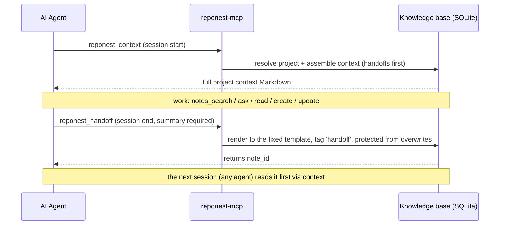

# AI Integration

RepoNest provides read channels and self-check tools for AI agents, all reusing the same `internal/service` implementation (behavior identical to the desktop app).

## Value proposition: RepoNest is a data source for AI, not an AI itself

**RepoNest does not call any large language model** — there is no OpenAI / Anthropic / any API key configuration in the code, no model selection, no endpoint settings. Its AI features are all about "exporting project knowledge for AI tools to consume", not built-in chat or generation. More precisely:

- RepoNest is the **data foundation**: it models raw git information into a structured, indexable, materializable local knowledge base (see [Storage Optimization and AI Value](../storage-optimization.md));
- AI tools (Claude Code / Cursor, etc.) **consume** this layer of data through the 13 MCP tools, fetching on demand and searching precisely.

For the argument for why this layer is better than letting AI read git directly, see [Storage Optimization and AI Value](../storage-optimization.md).

### Configuration keys (none involve models / APIs)

The whitelist in `internal/service/config.go` contains only 4 configuration keys, **none of which involve an LLM**:

| Key | Type | Default | Purpose |
|-----|------|---------|---------|
| `auto_import` | 0 / 1 | `1` | Whether to import Claude memory automatically (**the only AI-related setting**) |
| `daily_code_standard` | integer | `500` | The daily code target (lines per day), used for the dashboard goal display. The name says "code standard" but it is not an AI standard — easy to misread |
| `scan_depth` | integer | `2` | Scan directory depth |
| `git_author` | string | System git user | Affects "My" statistics / heatmap attribution |

## MCP Server (`reponest-mcp`)

MCP is the only AI execution interface (the `reponest` CLI is not shipped with releases). stdio protocol, the database is opened once per process, 13 tools (including 4 write operations: scan + note create/update + session handoff):

The two ends of the session memory protocol, in sequence:



How to read it: the protocol has exactly **two entry calls** (`reponest_context` to open a session, `reponest_handoff` to close it) and one guarantee in between — a handoff note is written once, tagged `handoff`, and `reponest_notes_update` refuses to overwrite it, so the next session always reads the same record at the top of its context.

| Tool | Description | Read/Write |
|------|-------------|------------|
| `reponest_scan` | Cold start: seeds the default scan roots and scans them synchronously, discovering local Git repositories (works with a pure MCP install, no desktop app needed) | Write |
| `reponest_context` | Injects the full project context at session start (tech stack / README / todos / highly relevant notes, with handoff notes pinned to the top) | Read |
| `reponest_handoff` | Structured handoff at session end (summary/changes/decisions/gotchas/next_steps), persisted to the database and read back pinned-to-top by the next `reponest_context`; notes written this way carry a `handoff` tag, and `reponest_notes_update` refuses to overwrite them | Write |
| `reponest_notes_list` | All notes | Read |
| `reponest_notes_search` | FTS5 search (query) | Read |
| `reponest_notes_read` | Read a note by ID | Read |
| `reponest_notes_create` | Create a new knowledge note | Write |
| `reponest_notes_update` | Update note content and metadata (partial update; refuses to overwrite `handoff` protocol notes) | Write |
| `reponest_projects_list` | All projects | Read |
| `reponest_projects_stats` | Project statistics (by id) | Read |
| `reponest_ask` | Q&A-style retrieval, top-5 text results | Read |
| `reponest_agent_score` | Check local AI readiness (DB / notes / search / MCP / llms.txt / SKILL.md / i18n) | Read |
| `reponest_integrity` | Audit data trustworthiness (FTS index drift / orphan rows / cache freshness / coverage) | Read |

### Readiness vs. data trustworthiness

The two self-check tools answer **different questions** — don't mix them up:

| Tool | Question it answers | Question it cannot answer |
|------|--------------------|---------------------------|
| `reponest_agent_score` | Is this installation configured correctly? (notes present? MCP reachable? i18n complete?) | Whether the data itself is correct |
| `reponest_integrity` | Can the data still be trusted? (has the index drifted? are there orphan rows? is the cache fresh?) | Whether the configuration is complete |

**Why the second one exists**: once the FTS5 index drifts out of sync with `project_notes`, search **silently returns fewer results**, while `agent_score` still reports "Search operational" — it measures connectivity, not content. `reponest_integrity` compares the index's real document count against the FTS5 `_docsize` shadow table (with an external-content table, a plain `SELECT rowid` reads the content table, so it would never reveal the drift) and checks that the sync triggers are all in place. For details, see the [checklist in `internal/integrity`](../../internal/integrity/integrity.go).

When an AI notices that "the search results seem incomplete", it should run `reponest_integrity` first instead of jumping to the conclusion that the knowledge base has little content.

### One-command registration (reponest-init, recommended)

Step one of [ADR-0009](../adr/0009-ide-presence.md): detect the binary and register every supported client with a single command; idempotent and safe to re-run:

```bash
node scripts/reponest-init/index.mjs --with-hook
```

- Detects `reponest-mcp` (override with `--bin`) and registers it with Claude Code (`.mcp.json`), Cursor (`.cursor/mcp.json`), VS Code (`.vscode/mcp.json`) and Windsurf (configs land only where the client's directory exists); JetBrains gets printed manual guidance
- `--with-hook` also installs the SessionEnd hook below (script + merged `settings.json`, backed up before changes)
- `--dry-run` previews every write; when the binary is missing it prints install guidance, and `--yes` writes the bare command name `reponest-mcp` (works once installed)

### Connect Claude Code manually (alternative)

```bash
claude mcp add reponest -- /path/to/reponest-mcp
```

Or write it into `.mcp.json` (project level) / `~/.claude.json` (user level):

```json
{
  "mcpServers": {
    "reponest": { "command": "/usr/local/bin/reponest-mcp", "args": [] }
  }
}
```

### Automatic handoff at session end (SessionEnd hook)

The real meaning of "zero-cost capture" is not "the agent remembers to call it on its own" — relying on goodwill is the same as making no promise. Claude Code's **SessionEnd hook** turns the handoff into part of the session lifecycle: the moment a session ends, the handoff happens, no matter how good the agent's memory is. This is also the path that lets a new user feel "the next session starts with full context" on day one.

Write it into `.claude/settings.json` (project level, shared with collaborators through the repository):

```json
{
  "hooks": {
    "SessionEnd": [
      {
        "hooks": [
          {
            "type": "command",
            "command": "\"$CLAUDE_PROJECT_DIR\"/.claude/hooks/reponest-handoff.sh"
          }
        ]
      }
    ]
  }
}
```

The companion script `.claude/hooks/reponest-handoff.sh` (remember to `chmod +x`):

```sh
#!/bin/sh
# SessionEnd hook: make the handoff automatic instead of relying on the
# agent's goodwill. One bounded headless turn costs a fraction of the
# session it preserves; "the agent will remember to call handoff" costs
# the entire exit record whenever it forgets.
set -u
cd "${CLAUDE_PROJECT_DIR:-$(pwd)}" || exit 0
command -v claude >/dev/null 2>&1 || exit 0
claude -p --mcp-config .mcp.json \
  'This session ended. Call reponest_handoff for the current project: a concise summary plus next_steps. If the project cannot be resolved, call reponest_context once first. Do nothing else.' \
  >/dev/null 2>&1 || true
```

Design points and costs (stated plainly, so the narrative doesn't oversell):

- **Trigger**: fired by Claude Code when a session ends; the trigger reason (`clear` / `logout` / `prompt_input_exit` / `other`) is written to stdin as JSON, and the script can read stdin and skip when appropriate (e.g. "the context was just cleared" doesn't need a handoff).
- **Cost**: one bounded headless turn (`claude -p`), a fraction of the whole session context it preserves; the hook has a default timeout (60s) and the script ends silently with `|| true`, so the session exit is never blocked.
- **Fallback path**: skipped outright when the `claude` CLI is missing; when MCP is not registered, the headless call fails and is swallowed — the protocol requires handoffs to be written through `reponest_handoff`; the hook only guarantees "it always fires" and never bypasses the protocol to write the database directly.
- **Protocol protection**: handoff notes carry the `handoff` tag and `reponest_notes_update` refuses to overwrite them (guarding against accidental clobbering); in the next session, `reponest_context` renders them in full, pinned to the top.
- The hook's event name and configuration fields evolve with Claude Code versions; before wiring it up, defer to `claude --help` and the official hooks documentation.

### Connect Cursor / other MCP clients

Add the same `command` pointing at the `reponest-mcp` binary in the client's MCP configuration (Cursor: `Settings → MCP → Add Server`).

## llms.txt and Markdown export (in-app)

- **llms.txt**: `GenerateLLMsTxt` generates a knowledge base overview in Markdown (project directory + tech stack + the 20 most recent knowledge notes), suitable for feeding an LLM to establish context. **llms.txt is an export format** (generated in-app, not shipped with the repository) and is not being expanded into a standalone product direction (see ADR-0006)
- **Note export**: any note can be exported as `.md` with YAML frontmatter (`ExportNoteAsMarkdown`)
- **Claude memory import**: idempotent import from `~/.claude/projects/*/memory/*.md` (see [Knowledge Base](knowledge.md))

## agent-score self-check

agent-score has been merged into the MCP tool `reponest_agent_score`; no separate build is needed. Call it from any MCP client to get the 7-item AI readiness score.

## Why not just let AI read the git repository

A common question: since Claude Code / Cursor can run `git log` and read files directly, why route through RepoNest at all? The core answer is **cost and determinism**:

- **Reading is expensive**: every direct `git log` or file-by-file scan is a one-off expense — repeated reads mean repeated tokens;
- **Reading is messy / incomplete**: large repositories inevitably exceed the context window and get truncated, and the model may hallucinate or skip binary files / `.gitignore`;
- **Reading is slow**: recomputing statistics on every call turns a seconds-scale task into a minutes-scale one.

RepoNest parses and materializes the raw git data into local SQLite **once at scan time** (`daily_stats` pre-aggregates statistics, `repo_meta` caches mined results, `project_notes_fts` builds the full-text index); after that, AI only fetches on demand and hits precisely through the MCP tools. For the full comparison and storage structure details, see [Storage Optimization and AI Value](../storage-optimization.md).

## Skill card for AI agents

[SKILL.md](https://github.com/sky-jiangcheng/repo-nest/blob/master/SKILL.md) at the repository root is a capability card written for agents to read (commands, tool table, paths) — feed it to them directly.
