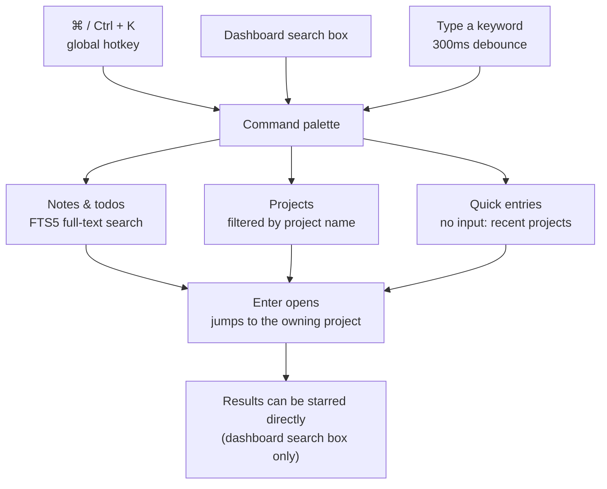

# Command Palette and Keyboard Shortcuts

How to read it: **two entries (the global hotkey and the dashboard search box) merge into one palette** with identical capabilities afterwards; the only difference is the marked edge — results from the dashboard search box can be starred directly. The three branches above are the three result classes (notes / projects / quick entries), and they all fall back to the same action below (open on Enter). Navigation uses `↑` `↓` with `aria-activedescendant`; `Esc` closes and returns focus to the trigger.

## Keyboard Shortcuts

| Shortcut | Action | Notes |
|----------|--------|-------|
| `⌘/Ctrl + K` | Open / close the command palette | Works globally |
| `↑` / `↓` | Move the selection | Navigate within the palette |
| `↵ Enter` | Open the selected item | Jump to the corresponding project |
| `Esc` | Close the palette | Focus returns to the trigger element |

> Also: pressing `/` inside the editor opens the block panel (see [Knowledge Base](knowledge.md)); deleting a todo or a note always requires a two-click confirmation.

## Command Palette

Open with `⌘/Ctrl + K`; a single input box merges three kinds of results:

- **Notes and todos**: FTS5 full-text search (title / content / todo titles); Enter jumps to the owning project
- **Projects**: filtered by project name; Enter opens the project details
- **Quick access**: with an empty input, recent projects are shown

Accessibility: implemented as an ARIA combobox-in-dialog with a focus trap and focus restore on close; `aria-activedescendant` drives keyboard selection.

## Dashboard Unified Search

The dashboard search box matches the command palette's capabilities, plus:

- Star / unstar repositories directly from the results
- Live search with a 300ms debounce
- Collapses automatically on outside click
