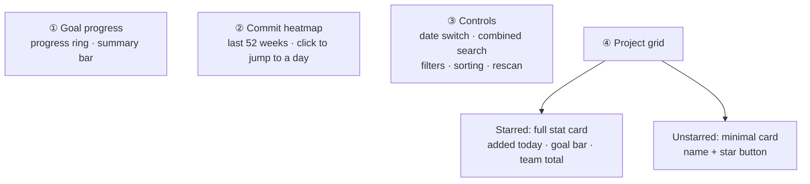

# Dashboard

The dashboard shows daily commit statistics, goal progress, and a year-long commit heatmap across all projects.

## Page structure (top to bottom)

How to read it: the page is a **vertical reading order** in four bands. The heatmap (②) is the global time view, the control bar (③) is its operating panel (switching the date changes both the heatmap and the project cards at once), and the project grid (④) splits cards by starred state — unstarred shows only the name, and you have to star a repository before it shows statistics. All three bands follow the **git author setting** (see [Settings](settings.md#author-configuration)).

### Goal progress

- **Progress ring**: today's (or the selected date's) personal added lines vs the daily goal; no goal is shown on non-workdays
- **Subtitle**: how far you are from the goal, personal additions / file count / repos involved
- **Summary bar**: team additions / deletions, personal additions / files, total todo count

### Commit heatmap

Daily commit density over the last 52 weeks (GitHub style). Click any cell to jump to that date and see that day's per-project data. Stats follow the current git author (Settings → Author configuration).

### Controls

- **Date switcher**: yesterday / today / any date
- **Unified search box**: search repos, notes, and todos as you type (300ms debounce; results can be starred or opened directly)
- **Filter**: all / starred only
- **Sort**: name / personal additions / file count / repo count
- **Rescan**: starts an async scan after a two-click confirmation; progress is shown live and data refreshes automatically when the scan completes

### Project grid

- **Starred repos**: full stat cards (today's additions, goal progress bar, repos / files / additions / deletions, net growth, team totals, todo and note badges)
- **Other repos**: minimal cards (name + star button); star one to expand it when needed

## Feature details

### Starring repos

Click the star to star a repo: the card expands into full stats and a **backfill history** button appears (backfills the last 365 days of data on demand). Unstarring collapses it back to a minimal card immediately.

### Goal progress

**Settings → Code standard** sets the daily goal in lines (default 500, range 100-10000).

- The progress ring and card goal bars show completion; hitting the goal shows 🎉
- On workdays below the goal, cards show a "below target" warning; weekends never warn

### Project grouping

Projects are grouped automatically by parent directory (with Monorepo detection). To split/merge manually, see [Project detail](project-detail.md).
