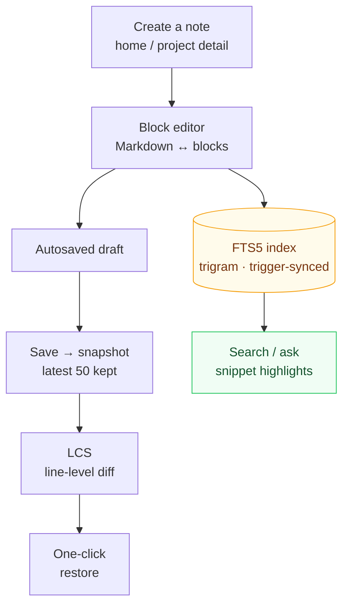

# Knowledge Base and Notes

The knowledge base is the app's home page and the hub for cross-project notes: Markdown / block editor, tag categories, FTS5 full-text search, version history, and AI memory import.

How to read it: one **trunk (edit → save → snapshot → diff → restore)** plus one **branch (index → search)**. The trunk solves "knowledge must not be lost"; the branch solves "knowledge must be findable" — both are triggered by the same save action (snapshots via a write trigger, the index via the FTS sync trigger), so there is no save button to remember. The **History** button on a note card enters the version side; the search box enters the branch.

## Managing notes

- **Create a note**: pick a project in "Quick create note" on the home page, or create one from the notes panel on the project detail page
- **Metadata**: title (falls back to the first line if left empty), tags (comma-separated), category (knowledge / log / idea / other), pinned
- **Move across projects**: use the "Linked project" dropdown while editing to migrate in one click
- **Autosaved drafts**: edits are saved locally in real time, so nothing is lost if the app closes unexpectedly

## Block editor

Type `/` to open the block panel and insert structured blocks:

| Block | Description |
|----|------|
| Callout | TIP / WARNING / NOTE callouts |
| Code block | with language highlighting |
| Mermaid diagram | flowcharts / sequence diagrams, etc. |
| Math formula | rendered with KaTeX |
| Todo list / table / divider | common structures |
| Collapsible block / Tabs | `
` and `` |

- Blocks can be drag-sorted, moved up or down, and deleted individually
- **Switch between Markdown and blocks at any time**: the storage format is always plain Markdown, so any editor can open it

## Rich rendering

highlight.js code highlighting, Mermaid diagrams, KaTeX math formulas, GFM callouts, and task lists.

## Search

- The home page search box is auto-focused; "Ask the knowledge base" mode returns answer snippets ranked by relevance
- FTS5 trigram + bm25 ranking, with snippets highlighting matched terms; short CJK queries automatically fall back to LIKE
- Covers notes and todos; the `⌘/Ctrl+K` command palette works from anywhere

## Version history

A snapshot is created automatically on every save (the latest 50 are kept). The **History** button on the note card opens:

- A version list (time, title)
- A line-level LCS diff of any version vs the current one (+/- markers)
- One-click restore to any historical version

## Import Claude memory

One click idempotently imports `~/.claude/projects/*/memory/*.md` as knowledge notes (re-importing updates existing notes instead of creating duplicates). **Settings → Plugins** shows the import source and lets you trigger it manually.

## Export

**Export .md** on the note card copies the Markdown — with YAML frontmatter (title / tags / project / type / updated time) — to the clipboard. For bulk AI consumption, see llms.txt in [AI integration](ai-integration.md).
