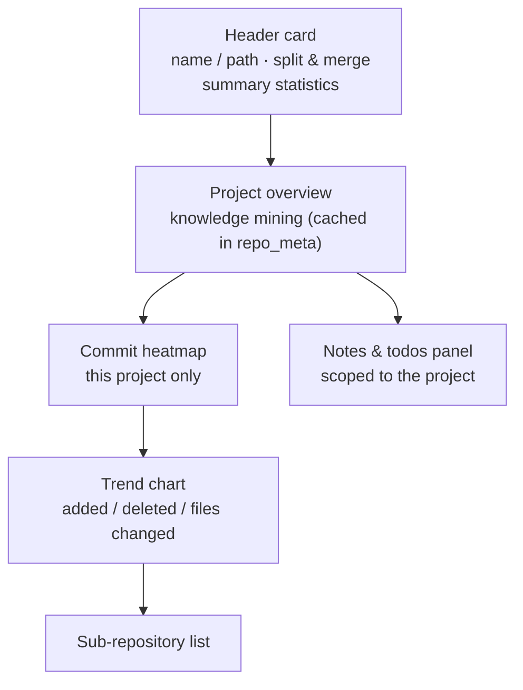

# Project Detail

The project detail page shows a single project's statistics, repository knowledge mining, heatmap and trends, plus its notes and todos.

## Page structure

How to read it: vertically top to bottom, with the header card in the top-left as the **single point of action** — "split down / merge up" adjusts the grouping level there, and notes and todos migrate with it; the remaining five blocks are read-only. The README / tech stack / dependencies / contributors in "Project overview" are a **mining cache** (mined live once, then read from `repo_meta`), while the heatmap and trend chart come from the materialized `daily_stats` table; both are **independent** of the dashboard's global heatmap.

### Header card

- Project name and path, automatic/manual grouping marker
- **Split down / merge up**: adjust the grouping level (a single transaction; notes and todos move with it)
- Summary stats: sub-repo count, active days, file changes, added/deleted lines

### Project overview (repository knowledge mining)

Extracted automatically from the repository working tree and cached in `repo_meta` ("live mining" on first run, "from cache" afterwards):

| Item | Description |
|------|------|
| README excerpt | up to 200 lines / 8KB |
| Tech stack | 20+ manifests recognized (package.json / go.mod / Cargo.toml / pom.xml / Dockerfile …) |
| Language share | bar chart of top languages by lines of code |
| Dependencies | npm / go.mod (including block require) / Cargo direct dependencies |
| Top contributors | top 5 from `git shortlog -sn` |
| Activity | total commits / last 30 days / active days within 90 days / active months / latest commit |
| Recent commit stream | latest 8 commits (time / branch / author / message) |

### Commit heatmap (per project)

Year-long commit density for **this project's repos** (independent of the dashboard's global heatmap).

### Trend line charts

A three-line comparison of additions / deletions / file changes, switchable across **last 7 days / last 30 days / all time**.

### Sub-repo list

Each repo's path, cumulative additions/deletions, and recent stat details.

### Notes and todos panel

Project-level knowledge notes (same source as the [knowledge base](knowledge.md)) and todos (add/remove / complete / reorder).
