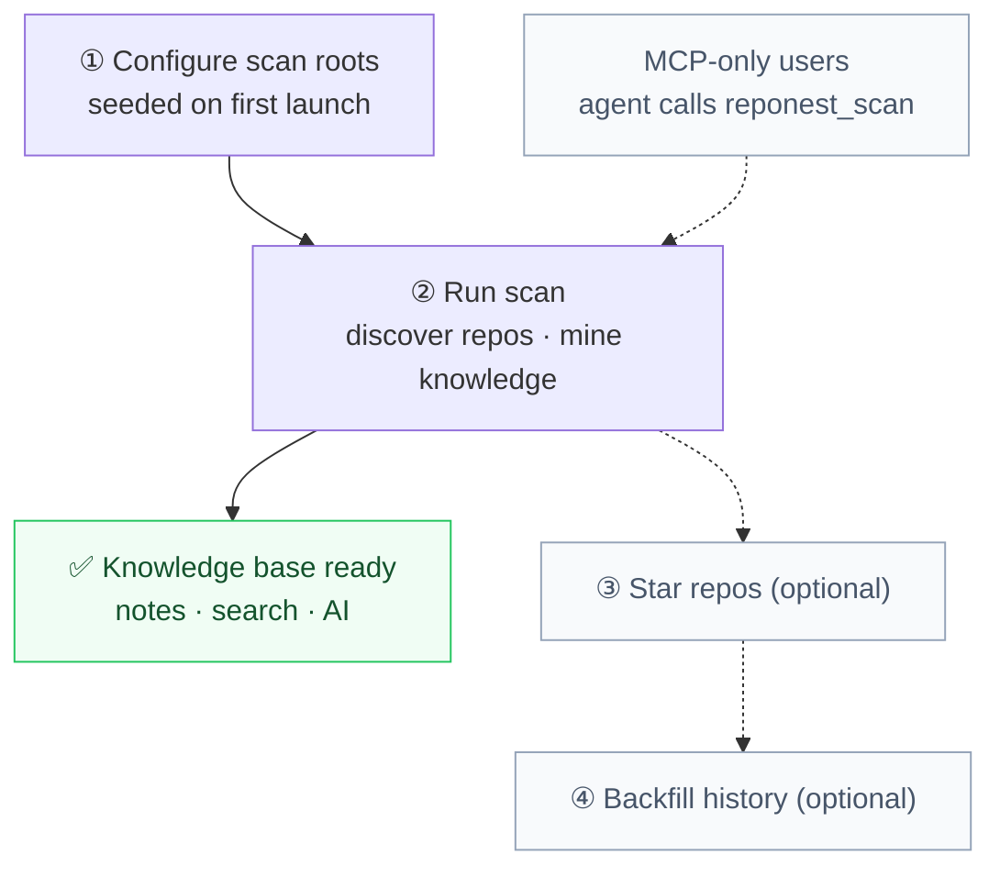

# Getting Started

RepoNest is a local-first desktop app (Wails v2, a single file with zero runtime dependencies). Its core value is a **cross-agent project memory layer**: it automatically discovers the Git repositories on your machine and quickly captures notes, dependencies, tech stack, and activity information, so you and any AI agent can search and reuse them. The dashboard and statistics are supporting capabilities, not the product's main entry point.

## Download and Install

The install script sets up both the desktop app and `reponest-mcp` (the MCP server used by AI clients).

### macOS / Linux

```bash
curl -fsSL https://raw.githubusercontent.com/sky-jiangcheng/repo-nest/master/scripts/install.sh | bash
```

On macOS it installs to `/Applications/RepoNest.app`, on Linux to `/usr/local/bin/reponest`; both place `reponest-mcp` in `/usr/local/bin`.

### Windows

```powershell
iwr -useb https://raw.githubusercontent.com/sky-jiangcheng/repo-nest/master/scripts/install.ps1 | iex
```

Or download the binary for your platform from [GitHub Releases](https://github.com/sky-jiangcheng/repo-nest/releases).

## First Launch

Launching opens the desktop window directly (a Wails app — no browser needed).

The five-minute path — the first two steps are required, the last two only affect dashboard statistics; MCP-only users (no desktop app) can simply have their agent call `reponest_scan` once:



How to read it: the solid path is required; **the boundary between solid and dashed is exactly the "knowledge base is usable" line** — once ② is done, notes / search / AI injection all work (see the callout below), while ③ and ④ only fill in the dashboard and change nothing if you never do them. MCP-only users take the other dashed edge and let the agent complete ① and ② itself.

### 1. Configure Scan Directories

On first launch, default scan roots are seeded automatically:

| Platform | Default scan scope |
|------|-------------|
| macOS | The current user's HOME directory |
| Linux | The current user's HOME directory |
| Windows | All drives except C: |

You can change this in **Settings → Scan Directories** (add or remove roots; scan depth 1-2 levels).

### 2. Run a Scan

Click **Rescan** on the dashboard; the app recursively discovers every Git repository under the scan roots and intelligently groups them into projects by directory.

> The first scan only registers repositories and projects; it does not pre-scan historical commit data.
>
> **At this point the knowledge base is already usable**: you can write notes, search, and hand context to AI (`reponest_context` / `reponest_handoff`). The starring and backfill steps below only affect dashboard statistics, not the knowledge base.

### 3. Star Repositories (optional, dashboard statistics)

Click the star icon on the dashboard to star the repositories you care about. Once starred, the card shows full statistics (new today / files / repositories / net change / team total).

### 4. Backfill History (optional, dashboard statistics)

Click the **Backfill History** button on a starred repository card to backfill the last 365 days of daily statistics for that repository (the progress ring and heatmap fill in right away).

### 5. Write Your First Knowledge Note

The first four steps only *register* your repositories; what actually makes the knowledge base valuable is leaving behind one note anyone can reuse. Two paths:

- **Desktop**: pick a project in **Quick create note** on the home page and write down how the project runs and where its gotchas are (see [Knowledge Base and Notes](features/knowledge.md));
- **AI side**: the session end automatically writes a `handoff` note, which is pinned at the top of the next session's context (see [AI Integration](features/ai-integration.md)).

## Core Features at a Glance

| Feature | Tier | Description |
|------|------|------|
| Knowledge base | Core | Cross-project note hub: Markdown, tags, pinning, FTS5 full-text search, version history |
| Repository knowledge mining | Core | Automatically extracts README, tech stack, language breakdown, dependencies, contributors, activity |
| Project understanding and retrieval | Core | Command palette `⌘/Ctrl+K`, global search, project context navigation |
| AI integration | Core | llms.txt, note export, MCP server (with agent-score self-check; see [AI Integration](features/ai-integration.md)) |
| Dashboard | Supporting | Daily goal progress ring, project cards, trend line charts, commit heatmap |
| Plugin system | Experimental | In-process Go scripts via yaegi + knowledge source import (see [Knowledge Source Import](plugins/overview.md)) |

The diagrams behind each page: the dashboard's page layering is in [Dashboard](features/dashboard.md#page-structure-top-to-bottom), the save-and-version chain of a note is in [Knowledge Base and Notes](features/knowledge.md), and why a knowledge base beats letting AI read git directly is in [Storage Optimization and AI Value](storage-optimization.md#2-advantages-over-reading-git-repositories-directly-with-ai).

## Data and Log Locations

| Item | macOS | Windows | Linux |
|------|-------|---------|-------|
| Database | `~/Library/Application Support/reponest/dashboard.db` | `%APPDATA%\reponest\dashboard.db` | `~/.config/reponest/dashboard.db` |
| Plugin directory | `…/reponest/plugins/` | `…/reponest\plugins\` | `…/reponest/plugins/` |
| Logs | `~/Library/Logs/reponest.log` | `%APPDATA%\reponest\logs\reponest.log` | `$XDG_STATE_HOME/reponest/reponest.log` (default `~/.local/state/reponest/`) |

The schema migrates automatically on upgrade; no manual data handling is needed. For detailed troubleshooting, see [Troubleshooting](troubleshooting.md).

## Build from Source

**Prerequisites**: Go 1.25+, Node.js 20+; the [Wails CLI](https://wails.io) v2.13+ is optional for development and debugging.

```bash
# Install frontend dependencies and build (the output is embedded into the binary via go:embed)
cd web && npm install && npm run build && cd ..

# Desktop app
go build -ldflags="-s -w" -o reponest .

# MCP server
go build -o reponest-mcp ./cmd/mcp/
```

Development mode: `wails dev` (frontend hot reload + Wails binding injection). Testing: `go test ./...`; frontend `npm test` / `npm run build` (strict tsc checks).

## Next Steps

- [Data and Backup](data-management.md): backup, migrating to a new machine, reset, and uninstall
- [Dashboard](features/dashboard.md): goal progress, heatmap, and sorting
- [Knowledge Base and Notes](features/knowledge.md): the block editor and full-text search
- [Settings](features/settings.md): scanning, daily code target, appearance, plugins
