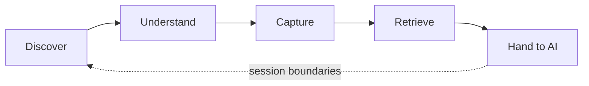
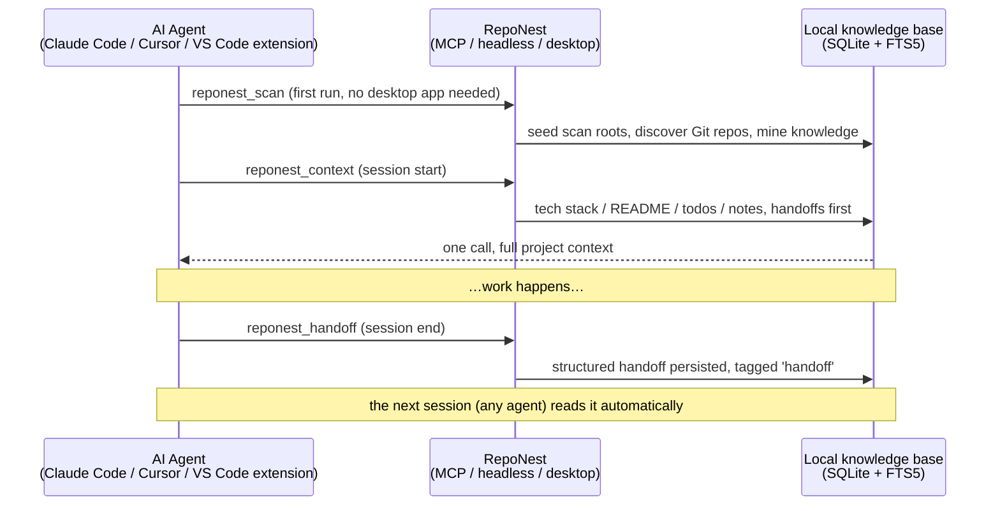
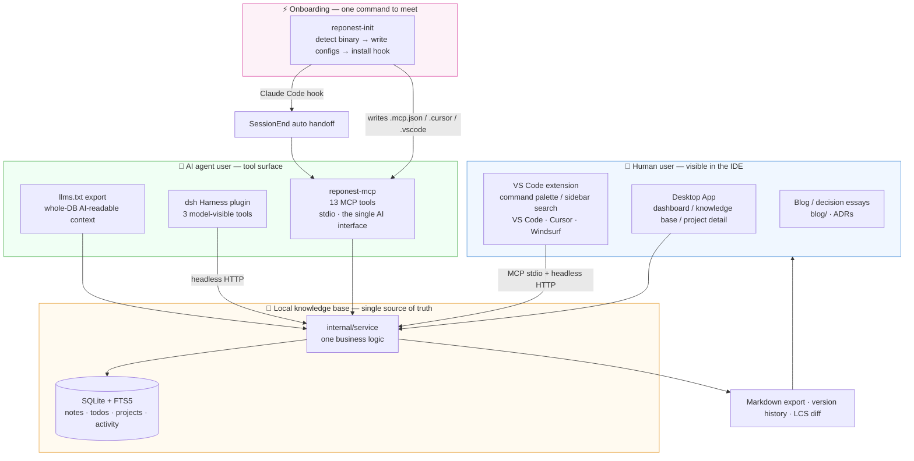

# RepoNest Documentation

<strong>The local-first memory layer for AI coding agents</strong> — automatically discover local Git projects, understand what changed and what knowledge has been captured, and hand searchable project context to any agent at session boundaries.

<!--NAV_LINKS-->

## Product Positioning

The core value of RepoNest: **turning local Git projects from things scattered across terminals and memory into searchable, reusable context**.

Current priorities:

1. **Local project understanding and knowledge context** comes first
2. The dashboard and statistics are supporting capabilities, not the main product story
3. Plugin/web-only capabilities are no longer expanded by default (the PWA has been removed from the main desktop build; see [ADR-0008](adr/0008-pwa-removal.md))

The frontend landing page is the **knowledge base**, and the navigation order is **Knowledge base → Dashboard → Settings** (see [ADR-0006](adr/0006-scope-freeze.md)).

The core loop:

The five steps map one-to-one onto the five capabilities listed at the end of this section. The dashed edge is what separates RepoNest from a plain notes tool: capturing knowledge is not the end state — it is the input of the next session.

The session memory loop (both ends of the protocol):

How to read it: the three participants are **three separate processes** — the AI side holds no data, RepoNest does not schedule agents, and the knowledge base is the only place the two meet. The upper half is cold start (`reponest_scan`) and session open (`reponest_context`); the lower half is session close (`reponest_handoff`). That last Note is the proof the loop closes: once the handoff is persisted, **the next session — possibly run by a different agent — reads it back automatically** via `reponest_context`, with nothing carried over by hand.

The "hand it to AI" step happens at **session boundaries**: `reponest_scan` builds the knowledge base, `reponest_context` injects the full context once when a session starts, and `reponest_handoff` captures a structured handoff when it ends — reusable across agents.

- **Discover**: automatically scans local Git repositories and intelligently groups them (monorepo / single repo)
- **Understand**: project details automatically surface a README summary, tech stack, dependencies, contributors, and activity
- **Capture**: Markdown notes (categories / tags / version history), with Claude memory import
- **Retrieve**: FTS5 full-text search (with a fallback for short CJK queries); hits can be located and explained
- **AI consumption**: the MCP session memory protocol (`reponest_scan` / `reponest_context` / `reponest_handoff`) plus llms.txt, ready for direct consumption by Claude Code, Cursor, and others

Feature tiers (core / supporting / experimental / deferred) and the scope-freeze rules are described in [ADR-0006](adr/0006-scope-freeze.md).

## The Big Picture: two audiences, one set of artifacts

RepoNest's artifacts serve two audiences at once: **you, sitting in the IDE** (who need to see it and click it) and **AI agents** (who need to read it and write it). Both paths share one local knowledge base — which is exactly why switching agents never loses context:

How to read it: **the top two rows are the shelf** — the desktop App and the VS Code extension meet humans, the MCP toolset, dsh plugin and llms.txt meet agents; **the middle is the vault** — every entry point calls the same service layer with zero logic duplication; **the bottom is the wiring** — `reponest-init` connects the agent side in one command, and the SessionEnd hook makes the handoff happen automatically at session end. Every arrow points inward at `internal/service`: no entry point bypasses it to talk to the database (exceptions noted in [Architecture](architecture.md#layering-backend)), which is why all three surfaces behave identically. Two edges deserve a second look: the `INIT` row only writes toward the agent side (`.mcp.json` / `.cursor` / `.vscode` / the SessionEnd hook) because it is a **one-time wiring action at install time**, and `OUT` (Markdown export / version history / LCS diff) points back at `HUMAN` because the readable artifact of captured knowledge is ultimately for people. The full distribution argument lives in [ADR-0009](adr/0009-ide-presence.md).

## About These Docs

This manual covers RepoNest's core features and use cases. The docs are written in Markdown (the single source of content, stored in the repository's `docs/` directory), rendered to HTML by `scripts/build-docs.mjs`, and deployed to GitHub Pages.

- **Read online**: <https://sky-jiangcheng.github.io/repo-nest/> — updated automatically with the master branch
- **Build locally**: `node scripts/build-docs.mjs` (uses marked from `web/node_modules`)
- **Report issues**: <https://github.com/sky-jiangcheng/repo-nest/issues>

## Quick Navigation

| I want to… | Go to |
|------|------|
| Install RepoNest and run the first scan | [Getting Started](getting-started.md) |
| Back up data / migrate to a new machine / uninstall | [Data and Backup](data-management.md) |
| View commits / goals / heatmap | [Dashboard](features/dashboard.md) |
| Write notes, search notes, recover old versions | [Knowledge Base and Notes](features/knowledge.md) |
| See a project's tech stack and dependencies | [Project Detail](features/project-detail.md) |
| Let Claude / Cursor read and write my knowledge base | [AI Integration](features/ai-integration.md) |
| Write a plugin or a knowledge source importer | [Plugin Guide](plugins/overview.md) |
| Understand the code layering and key decisions | [Architecture](architecture.md), [ADRs](adr/index.md) |
| Understand the storage layout and "why not let the AI read git directly" | [Storage Optimization and AI Value](storage-optimization.md) |
