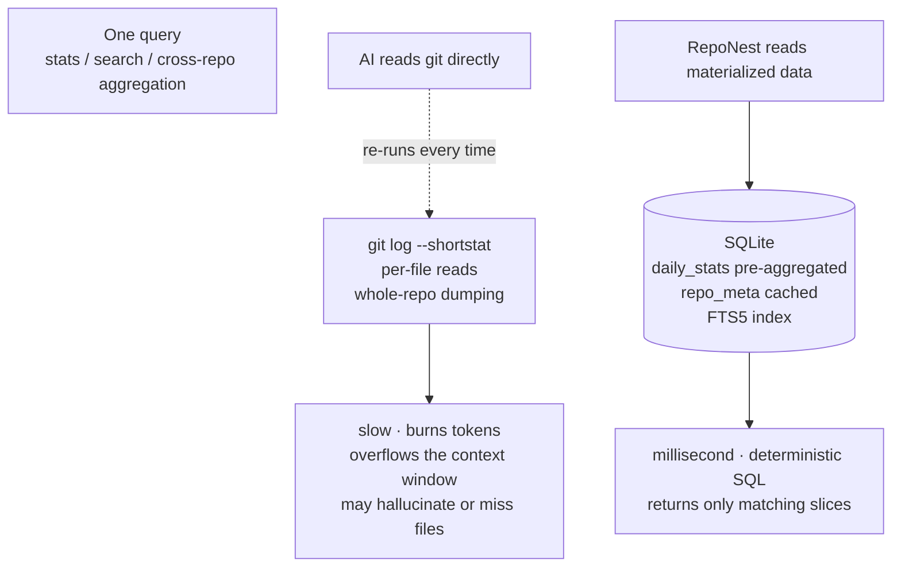

# Storage Structure Optimization and AI Value

What RepoNest does to git repositories is not compression/dedup-style storage optimization. Instead, it **models vast, unstructured raw git information into a structured, indexable, materializable, incrementally maintainable local knowledge base**. It solves the problem that reading a git repository directly is expensive, messy, incomplete, and slow for AI.

This page targets two audiences:

- Developers who want to understand where RepoNest actually stores data, and how
- Decision makers who want to understand why a repository should go through RepoNest first instead of being handed straight to AI

## 1. Storage structure optimizations for git repositories

| # | Optimization | Implementation (`internal/db/migrate.go` / `daily_stats.go` / `repo_meta.go`) |
|---|------|------|
| 1 | **Unstructured → relational model** | `projects(1) — repositories(N)` normalization; `project_notes` / `project_todos` separate "knowledge" from code repositories; `repo_meta` caches README / tech stack / languages / dependencies / contributors / activity as **JSON columns**, eliminating a filesystem scan on every query |
| 2 | **FTS5 full-text index** | `project_notes_fts` / `project_todos_fts` virtual tables with `tokenize='trigram'`. Trigram is friendly to Chinese / CJK; short queries automatically fall back to `LIKE` (see [ADR-0003](adr/0003-fts5-search.md)) |
| 3 | **Trigger dual writes** | Note insert / update / delete automatically sync FTS; updates also write a version snapshot `note_versions_snap` automatically (the `WHEN` condition has been narrowed so a snapshot is only written when content-bearing fields change). Zero maintenance in the application layer |
| 4 | **Secondary indexes** | `idx_projects_starred / collected / collected_at` speed up star filtering; `idx_note_versions(note_id, created_at DESC)` supports version history lookups |
| 5 | **Materialized statistics (core)** | `daily_stats` **pre-aggregates** raw `git log` commits by `(repository_id, stat_date, author)` (idempotent via `ON CONFLICT DO UPDATE`). Heatmap / summary read straight from this table with a `GROUP BY` and **never re-run `git log`** |
| 6 | **Mining result cache** | `repo_meta` uses `ON CONFLICT DO UPDATE` + `updated_at` for invalidation and re-mines incrementally, avoiding repeated filesystem scans |
| 7 | **Engineering-level tuning** | SQLite WAL + single-connection tuning, so concurrent reads and writes don't block; 12 versioned migrations applied automatically; migrations are immutable and append-only |

> Item 5 is the fundamental source of the "AI value": raw git information (commit history, file paths, file contents) is **volatile and expensive** — every direct `git log` or file-by-file read is a one-off, throwaway consumption. RepoNest parses everything **once at scan time**; after that, queries never touch the `git` command.

## 2. Advantages over reading git repositories directly with AI

How to read it: the two paths **diverge at "one query"**. When AI reads git directly, every query re-executes `git log` / per-file scanning (left), so the cost scales linearly with the number of queries and large repos hit the context window ceiling. RepoNest materializes raw git data into SQLite **once at scan time** (right), after which queries only land on that table — the materialized layer is not a cache, it is the **single source of truth**. The table below compares dimension by dimension.

| Dimension | AI reading git directly | RepoNest structured storage |
|------|--------------------|----------------------|
| **Retrieval** | File-by-file scans / whole-repo dumps; the context explodes | FTS5 trigram exact retrieval, Chinese-friendly, millisecond-level |
| **Statistics** | `git log` recomputed every time — slow and token-hungry | `daily_stats` is materialized; a `GROUP BY` returns it instantly, zero recomputation |
| **Cross-repository** | Single-repo view, hard to aggregate | `projects / repositories` normalized; one line of SQL aggregates across repositories |
| **Context window** | Large repos always blow the limit and get truncated | MCP tools fetch data on demand, feeding only the relevant fragments |
| **History** | Only the current snapshot | `note_versions` snapshots make knowledge traceable |
| **Determinism** | The model may hallucinate or skip binaries / `.gitignore` | Deterministic SQL, reproducible |
| **Cost** | Rereading = paying tokens again | Parse once, query unlimited times |
| **Offline / latency** | Depends on network and the model | Local SQLite, zero latency, works offline |

The two tables are two views of the same fact: **the upper one** says what is stored (seven storage optimizations), **the lower one** says what that buys. What actually does the work is not any single optimization but item 5 — statistics materialization — because it turns a "query" from "run a git command" into "look up a row". In code: `projects` / `repositories` normalization and `daily_stats` materialization live in [`internal/db`](../../internal/db); the FTS5 tables and triggers are defined in `migrate.go`; the mining cache is in `repo_meta.go`.

## 3. The core argument

The bottleneck for AI is not whether it can read git — it is that reading is **expensive, messy, incomplete, and slow**. At its core, RepoNest gives AI a layer of **structured memory**:

- Volatile raw git data (commits, paths, files) is parsed once at scan time → materialized into `daily_stats` / `repo_meta`; queries never touch the `git` command afterward;
- Knowledge notes live in tables backed by FTS5 indexes + version snapshots, so AI hits precisely with `reponest_notes_search` / `reponest_ask` instead of guessing semantically;
- The MCP interface lets AI **fetch data on demand** instead of dumping the whole repository into its context window every time.

In one sentence: **AI reading git directly = re-understanding the world from scratch every time; RepoNest = pre-organizing the world into an index AI can query precisely**. The former burns tokens and misses things; the latter organizes once, gets reused endlessly, and is deterministic and reliable.

## 4. This layer itself makes no LLM calls

To be clear: the storage structure, indexes, materialized statistics, and MCP interface — this data foundation **makes no large language model calls at all** (no API key / model / endpoint configuration). It is purely a data foundation, and AI consumes it through the 13 tools of [`reponest-mcp`](features/ai-integration.md). In other words, RepoNest is **a data source for AI**, not the AI itself.

Related docs:

- [Architecture](architecture.md) — layering, the scan pipeline, and a database table overview
- [AI Integration](features/ai-integration.md) — MCP / llms.txt integration and value positioning
- [Knowledge Base and Notes](features/knowledge.md) — FTS5 search and version history for notes
