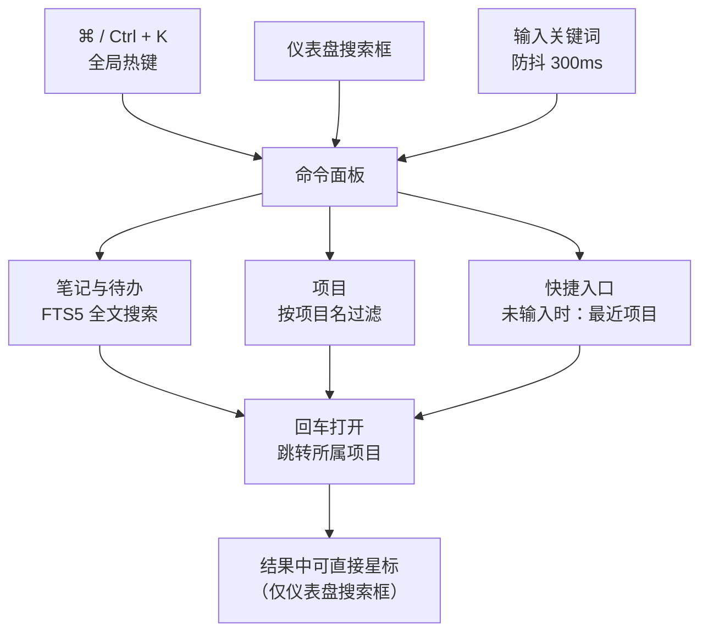

# 命令面板与快捷键

读图：**两个入口（全局热键与仪表盘搜索框）汇入同一个面板**，后续能力一致；差异只有标出的那一处——仪表盘搜索框的结果能直接星标仓库。上方三条分支对应三类结果（笔记 / 项目 / 快捷入口），下方回到同一个动作（回车打开）。面板内导航靠 `↑` `↓` 与 `aria-activedescendant`，`Esc` 关闭后焦点返还触发元素。

## 快捷键

| 快捷键 | 功能 | 说明 |
|--------|------|------|
| `⌘/Ctrl + K` | 打开 / 关闭命令面板 | 全局生效 |
| `↑` / `↓` | 移动选中项 | 面板内导航 |
| `↵ Enter` | 打开选中项 | 跳转到对应项目 |
| `Esc` | 关闭面板 | 焦点返回触发元素 |

> 此外：编辑器内 `/` 呼起块面板（见[知识库](knowledge.md)）；待办与笔记删除均为两击确认。

## 命令面板

`⌘/Ctrl + K` 打开，一个输入框联合三类结果：

- **笔记与待办**：FTS5 全文搜索（标题 / 内容 / 待办标题），回车跳转所属项目
- **项目**：按项目名过滤，回车进入项目详情
- **快捷入口**：未输入时展示最近项目

无障碍实现：ARIA combobox-in-dialog，焦点陷阱 + 关闭后焦点返还，`aria-activedescendant` 驱动键盘选中。

## 仪表盘联合搜索

仪表盘搜索框与命令面板能力一致，额外支持：

- 结果中直接星标 / 取消星标仓库
- 300ms 防抖实时搜索
- 点击外部自动收起

这也与[知识库](knowledge.md)的 FTS5 搜索是**同一后端能力的两处前端**：面板里的笔记搜索与首页搜索框走同一个全文索引（trigram + bm25），所以两者结果一致，只是首页额外多一个“询问知识库”模式。
