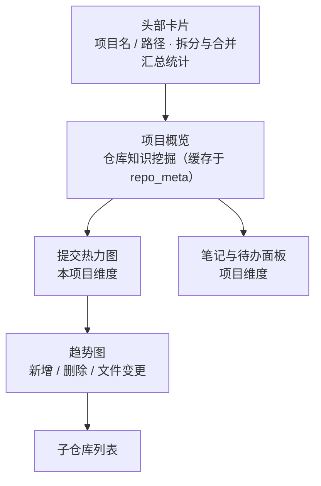

# 项目详情

项目详情页展示单个项目的统计、仓库知识挖掘、热力图与趋势，以及该项目的笔记与待办。

## 页面结构

读图：竖直自上而下，左上角头部卡片是**唯一的操作分叉点**——“向下拆分 / 向上合并”在这里调整分组级别，笔记与待办随迁；其余五块都是只读展示。“项目概览”里的 README / 技术栈 / 依赖 / 贡献者均为**挖掘缓存**（首次实时挖，之后读 `repo_meta`），而热力图与趋势图来自 `daily_stats` 物化表，两者与仪表盘的全局热力图**相互独立**。

### 头部卡片

- 项目名称与路径、自动/手动分组标记
- **向下拆分 / 向上合并**：调整分组级别（单事务，笔记与待办随迁）
- 汇总统计：子仓库数、活跃天数、文件变更、新增/删除行数

### 项目概览（仓库知识挖掘）

自动从仓库工作树提取，结果缓存于 `repo_meta`（首次「实时挖掘」，之后「来自缓存」）：

| 内容 | 说明 |
|------|------|
| README 摘录 | 最多 200 行 / 8KB |
| 技术栈 | 20+ manifest 识别（package.json / go.mod / Cargo.toml / pom.xml / Dockerfile …） |
| 语言占比 | 按代码行数统计的 Top 语言条形图 |
| 依赖清单 | npm / go.mod（含块状 require）/ Cargo 直接依赖 |
| Top 贡献者 | `git shortlog -sn` Top 5 |
| 活跃度 | 总提交 / 近 30 天 / 90 天活跃天数 / 活跃月 / 最近提交 |
| 最近提交流 | 最新 8 条（时间 / 分支 / 作者 / 信息） |

### 提交热力图（项目维度）

**本项目仓库**的全年提交密度（与仪表盘的全局热力图相互独立）。

### 趋势图

新增 / 删除 / 文件变更三线对比，范围可切换 **近 7 天 / 近 30 天 / 全部**。

### 子仓库列表

每个仓库的路径、累计新增/删除与最近统计明细。

### 笔记与待办面板

项目维度的知识笔记（[知识库](knowledge.md) 同源）与待办事项（增删 / 完成 / 排序）。
