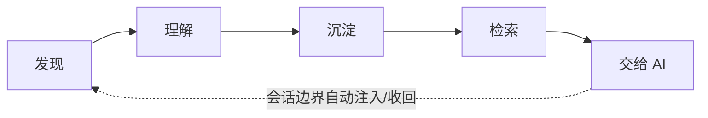
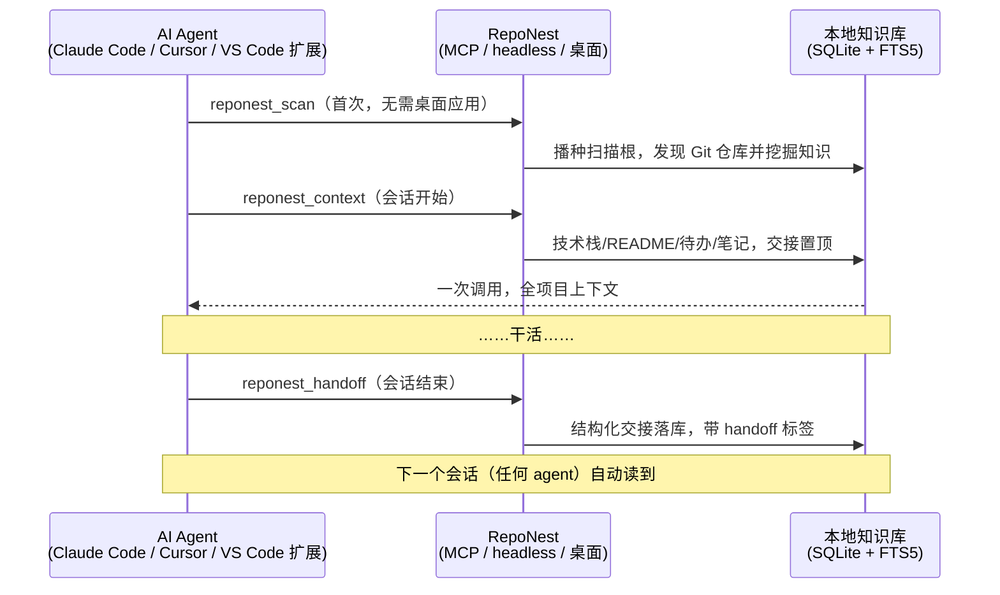
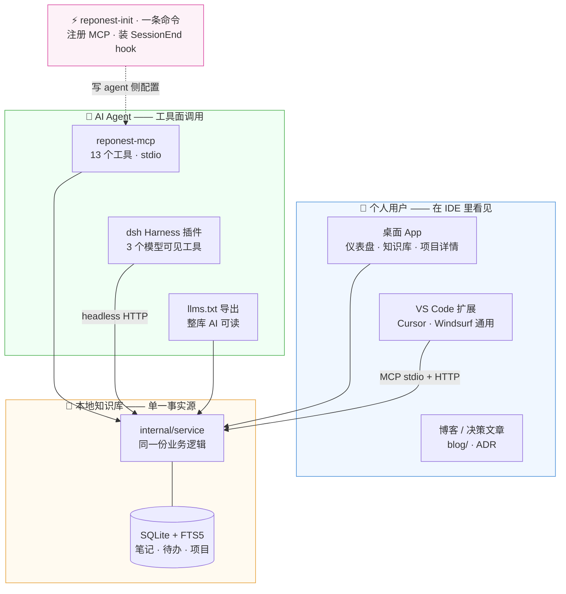

# RepoNest 文档

<strong>The local-first memory layer for AI coding agents</strong> — discover your Git repos, understand what changed, capture knowledge as searchable Markdown, and hand it to any agent in one tool call. <strong>本地优先的跨 agent 项目记忆层</strong>：自动发现本地 Git 项目，理解每个项目「现在发生了什么、沉淀了哪些知识」，并在会话边界自动注入与收回，让任何 agent 复用同一份项目上下文。

<!--NAV_LINKS-->

## 产品定位

RepoNest 的核心价值是：**让本地 Git 项目从‘散落在终端和记忆里’变成‘可检索、可复用的上下文’**。

当前优先级声明：
1. **本地项目理解与知识上下文** 是第一优先级
2. 仪表盘与统计是支持能力，不作为产品主叙事
3. 插件/Web-only 能力不再默认扩展（PWA 已移出桌面主构建，见 [ADR-0008](adr/0008-pwa-removal.md)）

前端默认页为**知识库**，导航顺序为 **知识库 → 仪表盘 → 设置**（见 [ADR-0006](adr/0006-scope-freeze.md)）。

核心闭环：

五个环节与下面五条能力一一对应（分别见本节末尾的「发现 / 理解 / 记录 / 检索 / AI 使用」）。虚线那条是**产品与一般知识库工具的区别**：知识沉淀不是终点，而是下一个会话的输入。

会话边界的记忆环（协议两端）：

读图：三个参与者是**三个独立进程**——AI 侧不持有数据，RepoNest 不调度 agent，知识库是双方唯一交汇的地方。上半段是冷启动（`reponest_scan`）与开会话（`reponest_context`），下半段是收会话（`reponest_handoff`）；最后一条 Note 是闭环成立的证据：交接笔记落库后，**下一个会话（可能是另一个 agent）经 `reponest_context` 自动读到**，不需要人工搬运。

其中「交给 AI 使用」落在**会话边界**：`reponest_scan` 建立知识库，`reponest_context` 开会话一次注入全上下文，`reponest_handoff` 收会话结构化交接，跨 agent 复用。

- **发现**：自动扫描本地 Git 仓库并按 Monorepo/单仓库智能分组
- **理解**：项目详情自动挖掘 README 摘要、技术栈、依赖、贡献者与活跃度
- **记录**：Markdown 笔记（分类/标签/版本历史），可导入 Claude 记忆
- **检索**：FTS5 全文搜索（含短 CJK 降级），命中可定位、可解释
- **AI 使用**：MCP 会话记忆协议（`reponest_scan` / `reponest_context` / `reponest_handoff`）+ llms.txt，供 Claude Code / Cursor 等直接消费

功能分级（核心 / 支持 / 实验性 / 暂缓）与范围冻结规则见 [ADR-0006](adr/0006-scope-freeze.md)。

## 全景图：两类用户，一套产物

RepoNest 的产物同时服务两类用户：**坐在 IDE 里的你**（需要看见它、点得到它）和 **AI agent**（需要读得到它、写得进它）。两条路径共享同一个本地知识库，这正是「换 agent 不丢上下文」的根基：

读法：**上面两排是「货架」**——桌面 App 和 VS Code 扩展跟人见面，MCP 工具面、dsh 插件、llms.txt 跟 agent 见面；**中间是「仓库」**——所有入口都只调同一份 service 层，零逻辑复制；**侧面的「接线员」**——`reponest-init` 一条命令把 agent 侧接好（写 `.mcp.json` / `.cursor` / `.vscode`，装 SessionEnd hook，让交接在会话结束时必然发生）。实线箭头全部向内指向 `internal/service`：没有任何一个入口绕过它直连数据库（例外见[架构说明](architecture.md#分层后端)），所以三端行为永远一致。

唯一的虚线是 `reponest-init`：它只写向 agent 侧，因为它是**装机时跑一次**的接线动作。另一条不可见的流向值得知道——`internal/service` 的 Markdown 导出与版本历史最终是给人看的可读产物（分发策略的完整论证见 [ADR-0009](adr/0009-ide-presence.md)）。

## 文档说明

本手册覆盖 RepoNest 的核心功能与使用场景。文档以 Markdown 编写（唯一内容源，存放于仓库 `docs/` 目录），由 `scripts/build-docs.mjs` 生成 HTML 后部署到 GitHub Pages。

手册有**英文（默认）与中文两个版本**，通过侧栏顶部的语言切换器互跳；英文内容源在 `docs/en/`，中文在 `docs/`。

- **在线浏览**：<https://sky-jiangcheng.github.io/repo-nest/>，随 master 分支自动更新
- **本地生成**：`node scripts/build-docs.mjs`（依赖 `web/node_modules` 中的 marked）
- **问题反馈**：<https://github.com/sky-jiangcheng/repo-nest/issues>

## 快速导览

| 我想… | 去看 |
|------|------|
| 安装并跑起第一次扫描 | [快速开始](getting-started.md) |
| 备份数据 / 换机迁移 / 卸载 | [数据与备份](data-management.md) |
| 看提交量 / 目标 / 热力图 | [仪表盘](features/dashboard.md) |
| 写笔记、搜笔记、找回旧版本 | [知识库与笔记](features/knowledge.md) |
| 看某个项目的技术栈与依赖 | [项目详情](features/project-detail.md) |
| 让 Claude / Cursor 读写我的知识库 | [AI 集成](features/ai-integration.md) |
| 写一个插件或知识源导入器 | [插件手册](plugins/overview.md) |
| 理解代码分层与关键决策 | [架构说明](architecture.md)、[ADR](adr/index.md) |
| 看懂存储结构与「为何不让 AI 直接读 git」 | [存储结构优化与 AI 价值](storage-optimization.md) |
