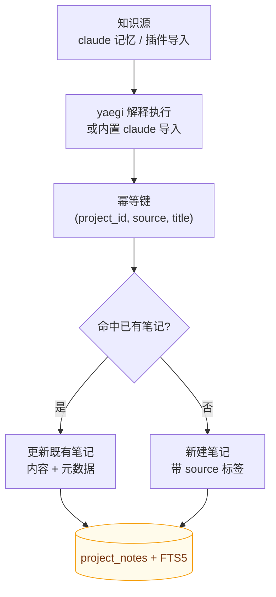

# 知识源导入

> ⚠️ **实验性**：插件系统接口可能变更，不作为平台扩展方向（见 [ADR-0006](../adr/0006-scope-freeze.md)）。

RepoNest 支持通过 yaegi 解释执行的 Go 脚本向知识库幂等导入文档。

读图：两条入口（内置 `claude` 记忆、插件脚本）**汇入同一条 upsert 路径**，幂等性由三元组 `(project_id, source, title)` 保证。因此重复导入是**更新**而非重复创建——重新导入不会把知识库越堆越脏。写入后由触发器同步 FTS 索引，导入的文档立刻可被 `reponest_notes_search` 命中。

## 内置知识源

| 源 | 说明 |
|----|------|
| `claude` | 导入 `~/.claude/projects/*/memory/*.md`，按项目名 / 仓库路径匹配归属 |

启动自动导入可在 **设置 → 插件** 开关（`auto_import` 配置项）。手动触发见设置页。

## 幂等导入语义

运行时按 `(project_id, source, title)` upsert：重复导入**更新**既有笔记而非重复创建。
