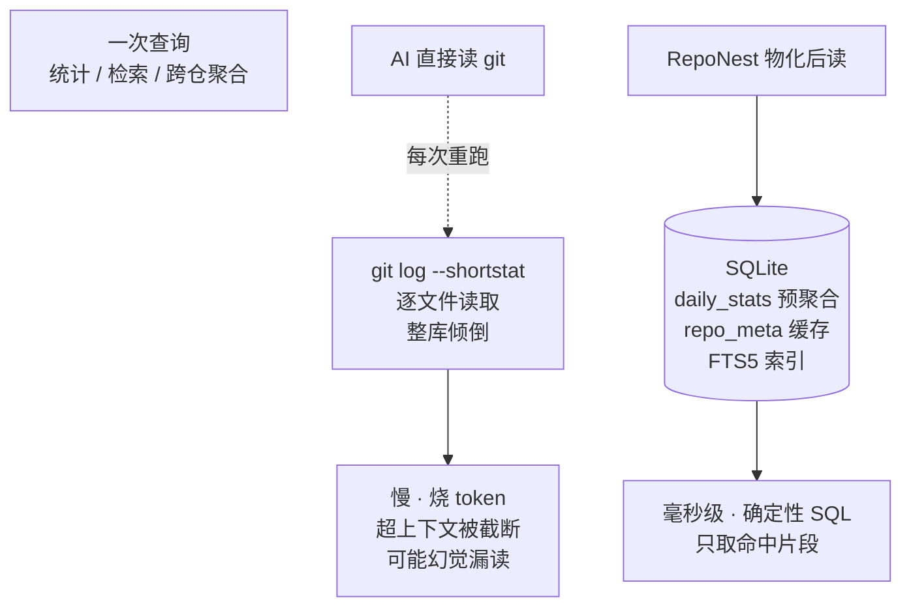

# 存储结构优化与 AI 价值

RepoNest 对 git 仓库做的不是「压缩 / 去重」类存储优化，而是**把非结构化、海量的 git 原始信息，建模成结构化、可索引、可物化、可增量维护的本地知识库**。它解决的是「AI 直接读 git 仓库时读得贵、读得乱、读不全、读得慢」的问题。

本文面向两类读者：

- 想理解「RepoNest 到底把数据存在哪、怎样存」的开发者
- 想理解「为什么不直接把仓库丢给 AI、而要先经过 RepoNest」的决策制定者

## 一、对 git 仓库的存储结构优化

| # | 优化 | 实现（`internal/db/migrate.go` / `daily_stats.go` / `repo_meta.go`） |
|---|------|------|
| 1 | **非结构化 → 关系模型** | `projects(1) — repositories(N)` 归一化；`project_notes` / `project_todos` 把「知识」从代码仓独立出来；`repo_meta` 把 README / 技术栈 / 语言 / 依赖 / 贡献者 / 活动缓存为 **JSON 列**，免每次文件系统扫描 |
| 2 | **FTS5 全文索引** | `project_notes_fts` / `project_todos_fts` 虚拟表，`tokenize='trigram'`。trigram 对中文 / CJK 友好，短查询自动降级 `LIKE`（见 [ADR-0003](adr/0003-fts5-search.md)） |
| 3 | **触发器双写** | 笔记 insert / update / delete 自动同步 FTS；update 时自动写版本快照 `note_versions_snap`（已收窄 `WHEN` 条件，仅内容类字段变化才落快照），应用层零维护 |
| 4 | **二级索引** | `idx_projects_starred / collected / collected_at` 加速收藏筛选；`idx_note_versions(note_id, created_at DESC)` 支持版本回溯 |
| 5 | **统计物化（核心）** | `daily_stats` 按 `(repository_id, stat_date, author)` 把 `git log` 原始 commits **预聚合**（`ON CONFLICT DO UPDATE` 幂等）。heatmap / summary 直接 `GROUP BY` 该表，**不重跑 `git log`** |
| 6 | **挖掘结果缓存** | `repo_meta` 用 `ON CONFLICT DO UPDATE` + `updated_at` 判断失效，增量重挖，避免重复扫描文件系统 |
| 7 | **工程层调优** | SQLite WAL + 单连接调优，并发读写不阻塞；12 个版本化迁移自动执行，迁移不可变、仅追加 |

上表每一项在代码里的位置：`projects` / `repositories` 归一化与 `daily_stats` 物化在 [`internal/db`](../internal/db)，FTS5 与触发器定义见 `migrate.go`，挖掘缓存见 `repo_meta.go`。

> 第 5 项是「AI 价值」的根本来源：git 仓库的原始信息（commit 历史、文件路径、文件内容）是**易变且昂贵的**，每次让 AI 直接 `git log` / 逐文件读都是一次性消费。RepoNest 在**扫描时一次性解析**，之后查询不再触碰 `git` 命令。

## 二、比 AI 直接读 git 仓库的优势

读图：两条路径的**分岔点在“每次查询”**。AI 直接读 git 时，每一次查询都要重新执行一遍 `git log` / 逐文件扫描（左），代价随查询次数线性叠加，且大仓会撞上上下文窗口上限。RepoNest 在**扫描时一次性**把 git 原始数据物化进 SQLite（右），之后查询只落在这张表上——物化层不是缓存，是**唯一事实源**。下表逐维度对照。

| 维度 | AI 直接读 git 仓库 | RepoNest 结构化存储 |
|------|--------------------|----------------------|
| **检索** | 逐文件扫描 / 整库倾倒，上下文爆炸 | FTS5 trigram 精确检索，中文友好，毫秒级 |
| **统计** | 每次 `git log` 重算，慢且烧 token | `daily_stats` 已物化，`GROUP BY` 即出，零重算 |
| **跨仓库** | 单仓视角，难以聚合 | `projects / repositories` 归一化，一行 SQL 跨仓聚合 |
| **上下文窗口** | 大仓必超 limit、被截断 | MCP 工具按需取数，只喂相关片段 |
| **历史演进** | 只有当前快照 | `note_versions` 版本快照，知识可追溯 |
| **确定性** | 模型可能幻觉 / 漏读二进制、`.gitignore` | 确定性 SQL，可复现 |
| **成本** | 重复读 = 重复 token | 一次解析，无限次查询 |
| **离线 / 延迟** | 依赖网络与模型 | 本地 SQLite，零延迟、可离线 |

两张表是同一件事的两个视角：**上表**说“存了什么”（七项存储结构优化），**下表**说“因此换来了什么”。真正起作用的不是任何单项优化，而是第 5 项统计物化——它把“查询”从“执行 git 命令”变成“查表”。

## 三、核心论点

AI 的瓶颈不是「能不能读 git」，而是**读得贵、读得乱、读不全、读得慢**。RepoNest 的本质是给 AI 配了一层**结构化记忆**：

- 把易变的 git 原始数据（commits、路径、文件）在扫描时一次性解析 → 物化进 `daily_stats` / `repo_meta`，之后查询不再触碰 `git` 命令；
- 把知识笔记建成带 FTS5 索引 + 版本快照的表，让 AI 用 `reponest_notes_search` / `reponest_ask` 精确命中而非语义猜；
- 通过 MCP 接口让 AI **按需取数**，而不是每次把整个仓库倒进上下文窗口。

一句话：**AI 直接读 git = 每次重新理解世界；RepoNest = 把世界预先整理成 AI 可精确查询的索引**。前者烧 token 且易漏，后者一次整理、反复复用、确定可靠。

## 四、这层结构本身不调用 LLM

需要强调：存储结构、索引、物化统计、MCP 接口——这套数据底座**不调用任何大语言模型**（无 API key / 模型 / endpoint 配置）。它纯粹是「数据底座」，AI 通过 [`reponest-mcp`](features/ai-integration.md) 的 13 个工具来消费它。换句话说，RepoNest 是 **AI 的数据源**，而非 AI 本身。

相关文档：

- [架构说明](architecture.md) — 分层、扫描管线、数据库表总览
- [AI 集成](features/ai-integration.md) — MCP / llms.txt 接入与价值定位
- [知识库与笔记](features/knowledge.md) — 笔记的 FTS5 搜索与版本历史
